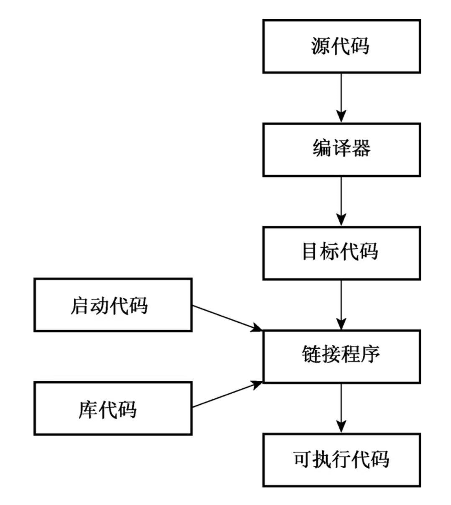
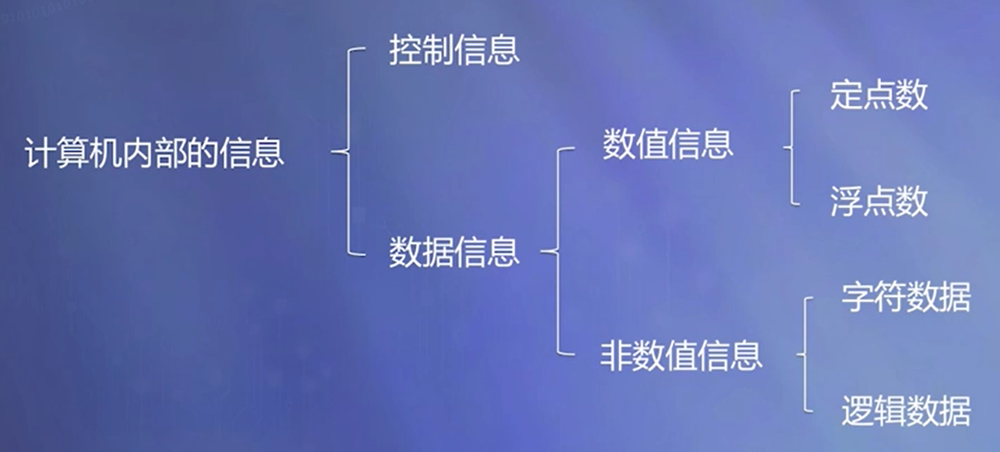

# C++ 语言基础

[TOC]

## 计算机语言和程序设计方法

### 计算机语言

+ 程序员与计算机沟通的语言；

+ 描述解决问题的方法和相关数据。

### 计算机语言的级别

#### 机器语言

+ 由二进制代码构成

+ 计算机硬件可以识别

+ 可以表示简单的操作

+ 例如：加法、减法、数据移动等等

#### 汇编语言

+ 将机器指令映射为助记符
  + 如ADD、SUB、mov等；

+ 抽象层次低，需要考虑机器细节。

#### 高级语言

+ 关键字、语句容易理解；

+ 有含义的数据命名和算式；

+ 抽象层次较高；
  + 例如，算式：a+b+c/d

+ 屏蔽了机器的细节；例如，这样显示计算结果：cout<<a+b+c/d

#### C++ 语言

+ **C++是面向对象的高级语言：** 将客观现实中的事物都看作**对象**，将同类的对象进行抽象形成**类**，类**封装**了细节，只对外暴露简单的接口，对象之间通过消息进行通信。

### C++支持的程序设计方法

+ 面向过程的程序设计方法（兼容 C 语言）；
  + 机器语言、汇编语言、高级语言都支持；
  + 最初的目的：用于数学计算；
  + 主要工作：设计求解问题的过程。
  + 大型复杂的软件难以用面向过程的方式编写

+ 面向对象的程序设计方法；
  + 由面向对象的高级语言支持；
  + 一个系统由对象构成；
  + 对象之间通过消息进行通信。

+ 泛型程序设计方法。

## 面向对象的基本概念

### 对象

+ 一般意义上的对象：现实世界中实际存在的事物。
+ 面向对象方法中的对象：程序中用来描述客观事物的实体。

### 抽象与分类

+ 分类所依据的原则——抽象；
+ 抽象出同一类对象的共同属性和行为，形成类；
+ 类与对象是类型与实例的关系，犹如模具与铸件之间的关系。

### 封装

+ 隐蔽对象的内部细节；
+ 对外形成一个边界；
+ 只保留有限的对外接口；
+ 使用方便、安全性好。

### 继承

+ 意义在于软件复用；
+ 改造、扩展已有类形成新的类。

### 多态

同样的消息作用在不同对象上，可以引起不同的行为。

### 面向对象编程（OOP）

面向对象编程（OOP）的本质是设计并扩展自己的数据类型。

## C++ 与 C 的联系与区别

### 联系

C++ 在 C 语言的基础上添加了对面向对象编程和泛型编程的支持。C++融合了 3 种不同的编程方式：C 语言代表的过程性语言、C++ 在 C 语言基础上添加的类代表的面向对象语言、C++模板支持的泛型编程。

C++ 是 C 语言的超集，也就是说任何有效的 C 程序都是有效的 C++ 程序。

### 区别

在设计思想上， C++ 是面向对象的语言，而 C 是面向过程的结构化编程语言。 

C++ 支持面向对象编程，具有封装、继承和多态三种特性。

C++ 支持范式编程（泛型编程，generic programming）。

## 程序的开发过程

### 程序

源程序：用源语言写的，有待翻译的程序；

目标程序：源程序通过翻译程序加工以后生成的机器语言程序；

可执行程序：连接目标程序以及库中的某些文件，生成的一个可执行文件；例如：Windows系统平台上的.EXE文件。

### 三种不同类型的翻译程序

汇编程序：将汇编语言源程序翻译成目标程序；

编译程序：将高级语言源程序翻译成目标程序；

解释程序：将高级语言源程序翻译成机器指令，边翻译边执行。

+ Java程序就是半编译半解释的，目的是为了跨平台。
  + “半编译”：Java源代码编译为中间二进制码，所有平台的Java虚拟机都可以识别。
  + “半解释”：Java虚拟机对中间二进制码进行解释，转换成本地系统真正可以识别、执行的二进制码。
+ C++程序是直接编译为本地机器语言代码。

### C++ 程序的开发过程

1. 源程序编辑：使用文本编辑器编写程序并保存到文件，这个文件就是程序的源代码。
2. 编译：编译源代码。也就是运行一个程序，将源代码翻译为机器语言。包含了翻译后的程序的文件就是程序的目标代码（object code）。
3. 链接：将目标代码与其他代码链接起来。链接指的是将目标代码同所使用的库（库中封装了一系列函数的目标代码）以及一些标准的启动代码（startup code）组合起来，生成程序的运行阶段版本。包含该最终产品的文件被称为可执行代码。

## 计算机中的信息与存储单位

### 计算机的基本功能

+ 算术运算；

+ 逻辑运算。

### 计算机中信息

+ 控制信息——指挥计算机操作；

+ 数据信息——计算机程序加工的对象。

## 内置的数据类型

内置的 C++ 类型分为两组：基本类型和复合类型。基本类型包括整数和浮点数的若干变体。复合类型包括数组、字符串、指针和结构。

