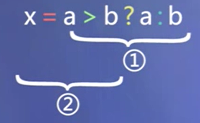

# 运算与表达式

[TOC]

## 算数运算

+ 基本算术运算符
  + `+`、`-`、`*`、`/`（若整数相除，结果取整，小数部分丢去）
  + %（取余，操作数为整数）

+ 优先级与结合性：先乘除，后加减，同级自左至右

+ ++, --（自增、自减）
  + 例：i++;  --j;

### 除法运算符

对于除法运算符 `/` ：

+ 如果两个操作数都是整数，则结果为商的整数部分，商的小数部分被丢弃。
+ 如果其中有一个（或两个）操作数是浮点值，则小数部分将保留，结果为浮点数。


## 赋值运算

+ 将值赋给变量

+ 赋值运算符 “=”

+ 赋值表达式：

  + 用赋值运算符连接的表达式

  + 例：

    n=5

    n = n + 5
    
  + 表达式的值：赋值运算符左边对象被赋值后的值
  
  + 表达式的类型：赋值运算符左边对象的类型

+ 复合的赋值运算符：

  + 10种复合运算符：+=，-=，*=，/=，%=，<<=，>>=，&=，^=，|=

  + 例：

    a += 3 等价于 a = a + 3

    x *= y + 8 等价于 x = x * (y + 8)


## 逗号运算和逗号表达式

+ 格式：`表达式1, 表达式2`

+ 求解顺序及结果
  + 先求解表达式1，再求解表达式2
  + 逗号表达式的最终结果为表达式2的值
  + 例：a = 3 * 5 , a * 4  最终结果为60


## 关系运算与关系表达式

+ 关系运算是比较简单的一种逻辑运算，优先次序为：

  

+ 关系表达式是一种最简单的逻辑表达式
  
+ 其结果类型为 bool，值只能为 true 或false。
  
+ 例如：a > b，c <= a + b，x + y == 3


## 逻辑运算与逻辑表达式

+ 逻辑运算符： !(非)   &&(与)    ||(或)
  + 优先次序： 高     →      低

+ 逻辑运算结果类型：bool，值只能为 true 或false

+ 逻辑表达式，例如：(a > b) && (x > y)

### &&（与）

#### 运算规则

+ 两侧表达式都为真，结果为真；
+ 有一侧表达式为假，结果为假。

#### “短路特性”

```
表达式1 && 表达式2
```

先求解表达式1：

+ 若表达式1的值为false，则最终结果为false，不再求解表达式2
+ 若表达式1的结果为true，则求解表达式2，以表达式2的结果作为最终结果

### ||（或）

#### 运算规则

+ 两侧表达式都为假，结果为假；
+ 有一侧表达式为真，结果为真。

#### “短路特性”

```
表达式1 || 表达式2
```

先求解表达式1

+ 若表达式1的值为true，则最终结果为true，不再求解表达式2
+ 若表达式1的结果为false，则求解表达式2，以表达式2的结果作为最终结果


## 条件运算符与条件表达式

+ 一般形式

  ```
  表达式1 ? 表达式2 : 表达式3
  ```

  + 表达式1 必须是bool 类型

+ 执行顺序：

  先求解表达式1：

  + 若表达式1的值为true，则求解表达式2，表达式2的值为最终结果
  + 若表达式1的值为false，则求解表达式3，表达式3的值为最终结果

+ 条件运算符优先级高于赋值运算符，低于逻辑运算符

  + 例：

    

+ 表达式1是bool类型，表达式2、3的类型可以不同，条件表达式的最终类型为2 和3 中较高的类型。


## sizeof 运算

+ 语法形式

  ```
  sizeof (类型名)
  或 
  sizeof 表达式
  ```

+ 结果值：“类型名”所指定的类型，或“表达式”的结果类型所占的字节数。

+ 例：

  ```c++
  sizeof(short)
  sizeof x
  ```

sizeof 运算符返回类型或变量的长度，单位为字节。“字节”的含义依赖于实现，因此在一个系统中，两字节的 int 可能是 16 位，而在另一个系统中可能是 32 位。


## 位运算

### 按位与（&）

+ 运算规则：将两个运算量的每一个位进行逻辑与操作

+ 用途：

  + 将某一位置0，其他位不变。

    例如：将char型变量a的最低位置0: a = a & 0xfe; (0xfe:1111 1110)
    
  + 取指定位。
  
    例如：有char c; int a; 取出a的低字节，置于c中：c=a & 0xff; (0xff:1111 1111)

### 按位或（|）

+ 运算规则：将两个运算量的每一个位进行逻辑或操作
+ 用途：
  + 将某些位置1，其他位不变。
  + 例如：将 int 型变量 a 的低字节置 1 ：a = a | 0xff;

### 按位异或（^）

+ 运算规则

  + 两个操作数进行异或：

    若对应位相同，则结果该位为 0，

    若对应位不同，则结果该位为 1，

+ 用途举例：使特定位翻转（与0异或保持原值，与1异或取反）
  + 例如：要使 01111010 低四位翻转：01111010 ^ 00001111 = 01110101

### 取反（~）

+ 运算规则
  + 单目运算符，对一个二进制数按位取反。

+ 例：

  025：0000000000010101

  ~025：1111111111101010

### 移位（<<、>>）

+ 左移运算（<<）
  + 左移后，低位补0，高位舍弃。

+ 右移运算（>>）

  + 右移后：

    低位：舍弃

    高位：

    ​	无符号数：补0

    ​	有符号数：补“符号位”


## 运算优先级

自行查表


## 类型转换

#### 1. 初始化和赋值进行的转换

C++ 允许将一种类型的值赋给另一种类型的变量。这样做时，值将被转换为接收变量的类型。

+ 将一个非布尔类型的算术值赋给布尔类型时，算术值为0则结果为false，否则结果为true。
+ 将一个布尔值赋给非布尔类型时，布尔值为false则结果为0，布尔值为true则结果为1
+ 将一个浮点数赋给整数类型时，结果值将只保留浮点数中的整数部分，小数部分将被丢弃，而不是四舍五入（查找最接近的整数）。
+ 将一个整数值赋给浮点类型时，小数部分记为0。如果整数所占的空间超过了浮点类型的容量，精度可能有损失。

#### 2. 以 {} 方式初始化时进行的转换（C++11）

#### 3. 表达式中的转换

当同一个表达式中包含两种不同的算数类型时，C++将执行两种自动转换：首先，一些类型在出现时便会自动转换；其次，有些类型在与其他类型同时出现在表达式中时将被转换。

自动转换：在计算表达式时，C++将 bool、char、unsigned char、signed char 和 short 值转换为 int。这些转换被称为整型提升（integral promotion）。

将不同类型进行算数运算时，也会进行一些转换。编译器通过校验表来确定在算数表达式中执行的转换。

**切勿混用带符号类型和无符号类型。** 如果表达式里既有带符号类型又有无符号类型，当带符号类型取值为负时会出现异常结果，这是因为带符号数会自动地转换成无符号数。例如，在一个形如 a * b 的式子中，如果 a = - 1，b = 1，而且 a 和 b 都是 int，则表达式的值显然为 -1。然而，如果 a 是 int，而 b 是 unsigned，则结果须视在当前机器上 int 所占位数而定。在当前环境中，结果是 4294967295。（测试代码如下）

```c++
#include <iostream>

using namespace std;
 
int main(){
   int a = -1;
   unsigned int b = 1;
   cout << a * b << endl;
   return 0;
}
```

+ 一些二元运算符（算术运算符、关系运算符、逻辑运算符、位运算符和赋值运算符）要求两个操作数的类型一致。
+ 在算术运算和关系运算中如果参与运算的操作数类型不一致，编译系统会自动对数据进行转换（即隐含转换），基本原则是将低类型（数据表示范围窄）数据转换为高类型（数据表示范围宽）数据。

#### 4. 传递参数时的转换

#### 5. 强制类型转换（显式转换）

显式类型转换的作用是将表达式（value）的结果类型转换为类型说明符（typeName）所指定的类型。 

通用格式如下：

```c++
(typeName) value	// converts value to typeName type
typeName (value)	// cpnverts value to typeName type
```

第一种格式来自 C 语言，第二种格式是纯粹的 C++。新格式的想法是，要让强制类型转换就像是函数调用。这样对内置类型的强制类型转换就像是为用户定义的类设计的类型转换。

也可以采用以下方式：

```c++
类型转换操作符<typeName>(value)
```

类型转换操作符可以是：const_cast、dynamic_cast、reinterpret_cast、static_cast

例：`int(z)`，`(int)z`，`static_cast<int>(z)` 三种完全等价