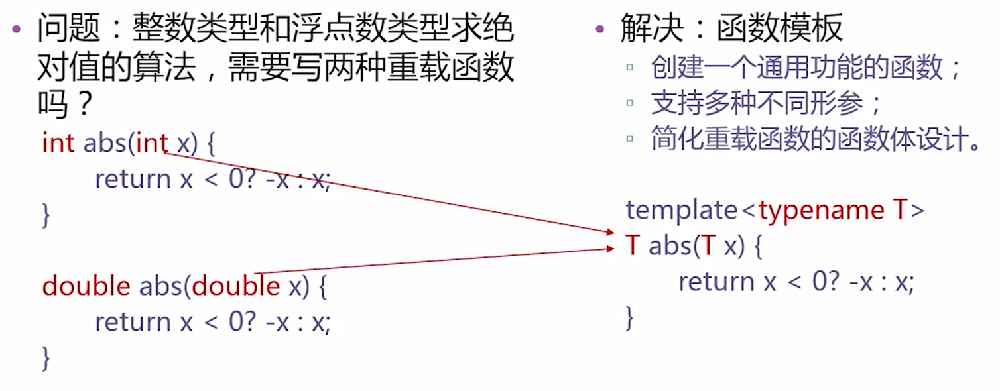
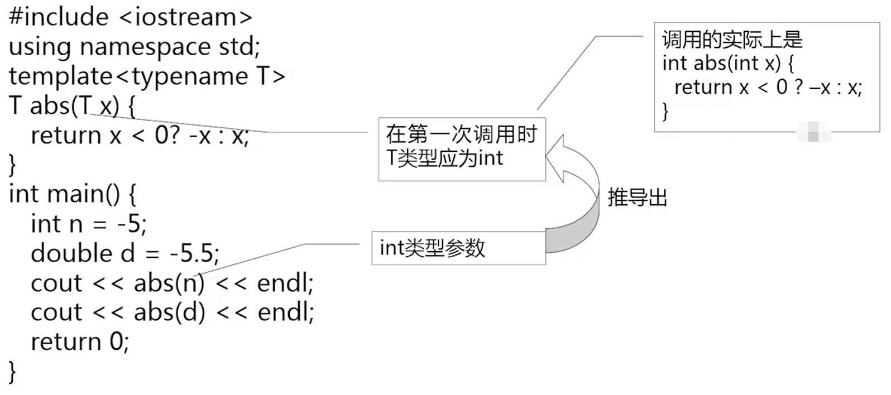
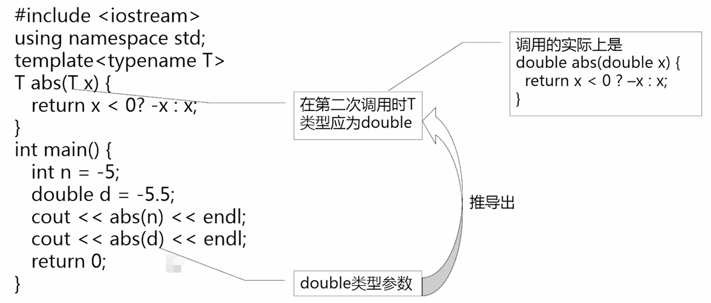

# 模板与群体数据

## 模板

### 函数模板

- 思考：如果重载的函数，其解决问题的逻辑是一致的、函数体语句相同，只是处理的数据类型不同，那么写多个相同的函数体，是重复劳动，而且还可能因为代码的冗余造成不一致性。
- 解决：使用模板

#### 例子：求绝对值函数的模板







#### 函数模板定义语法

语法形式：

```c++
template <模板参数表>
函数定义
```

模板参数表的内容：

+ 类型参数：class（或typename） 标识符

+ 常量参数：类型说明符 标识符

+ 模板参数：template <参数表> class标识符

#### 例子：函数模板的示例

```c++
#include <iostream>
using namespace std;

template <class T>  //定义函数模板
void outputArray(const T *array, int count) {
    for (int i = 0; i < count; i++)
        //如果数组元素是类的对象，需要该对象所属类重载了流插入运算符“<<”
        cout << array[i] << " "; 
    cout << endl;
}

int main() {     
    const int A_COUNT = 8, B_COUNT = 8, C_COUNT = 20;
    int a [A_COUNT] = { 1, 2, 3, 4, 5, 6, 7, 8 };
    double b[B_COUNT] = { 1.1, 2.2, 3.3, 4.4, 5.5, 6.6, 7.7, 8.8 };
    char c[C_COUNT] = "Welcome!";

    cout << " a array contains:" << endl;
    outputArray(a, A_COUNT);    
    cout << " b array contains:" << endl;
    outputArray(b, B_COUNT);    
    cout << " c array contains:" << endl;
    outputArray(c, C_COUNT);    
    return 0;
}
```

运行结果如下：

```
a array contains:
1 2 3 4 5 6 7 8
b array contains:
1.1 2.2 3.3 4.4 5.5 6.6 7.7 8.8 
c array contains:
W e l c o m e!
```

#### 注意

- 一个函数模板并非自动可以处理所有类型的数据
- 只有能够进行函数模板中运算的类型，可以作为类型实参
- 自定义的类，需要重载模板中的运算符，才能作为类型实参


 ### 类模板

#### 类模板的作用

使用类模板使用户可以为类声明一种模式，使得类中的某些数据成员、某些成员函数的参数、某些成员函数的返回值，能取任意类型（包括基本类型的和用户自定义类型）。

#### 类模板的声明

类模板： 

```c++
template <模板参数表> 
class 类名 
{类成员声明};
```

如果需要在类模板以外定义其成员函数，则要采用以下的形式： 

```c++
template <模板参数表> 
类型名 类名<模板参数标识符列表>::函数名(参数表)
```

#### 例子：类模板示例

```c++
#include <iostream>
#include <cstdlib>
using namespace std;
struct Student {
  int id;       //学号
  float gpa;    //平均分
}; 
template <class T>
class Store {//类模板：实现对任意类型数据进行存取
private:
    T item; // item用于存放任意类型的数据
    bool haveValue;  // haveValue标记item是否已被存入内容
public:
    Store();
    T &getElem();   //提取数据函数
    void putElem(const T &x);  //存入数据函数
};

template <class T>  
Store<T>::Store(): haveValue(false) { } 
template <class T>
T &Store<T>::getElem() {
    //如试图提取未初始化的数据，则终止程序
    if (!haveValue) {   
        cout << "No item present!" << endl;
        exit(1);    //使程序完全退出，返回到操作系统。
    }
    return item;        // 返回item中存放的数据 
}
template <class T>
void Store<T>::putElem(const T &x) {
    // 将haveValue 置为true，表示item中已存入数值   
    haveValue = true;   
    item = x;           // 将x值存入item
}

int main() {
    Store<int> s1, s2;  
    s1.putElem(3);  
    s2.putElem(-7);
    cout << s1.getElem() << "  " << s2.getElem() << endl;

    Student g = { 1000, 23 };
    Store<Student> s3;
    s3.putElem(g); 
    cout << "The student id is " << s3.getElem().id << endl;

    Store<double> d;
    cout << "Retrieving object D... ";
    cout << d.getElem() << endl;
   //d未初始化，执行函数D.getElement()时导致程序终止
    return 0;
}
```


## 线性群体

- 群体是指由多个数据元素组成的集合体。群体可以分为两个大类：**线性群体**和**非线性群体**。
- 线性群体中的元素按位置排列有序，可以区分为第一个元素、第二个元素等。
- 非线性群体不用位置顺序来标识元素。
- 线性群体中的元素次序与其逻辑位置关系是对应的。在线性群体中，又可按照访问元素的不同方法分为**直接访问、顺序访问和索引访问**。
- 在本章我们只介绍直接访问和顺序访问。


## 数组类模板

- 静态数组是具有固定元素个数的群体，其中的元素可以通过下标直接访问。

- - 缺点：大小在编译时就已经确定，在运行时无法修改。

- 动态数组由一系列位置连续的，任意数量相同类型的元素组成。

- - 优点：其元素个数可在程序运行时改变。

- vector就是用类模板实现的动态数组。

### 动态数组类模板

```c++
#ifndef ARRAY_H
#define ARRAY_H
#include <cassert>

template <class T>  //数组类模板定义
class Array {
private:
    T* list;        //用于存放动态分配的数组内存首地址
    int size;       //数组大小（元素个数）
public:
    Array(int sz = 50);     	//构造函数
    Array(const Array<T> &a);   //复制构造函数
    ~Array();           		//析构函数
    Array<T> & operator = (const Array<T> &rhs);    //重载"=“
    T & operator [] (int i); 						//重载"[]”
    const T & operator [] (int i) const;     		//重载"[]”常函数
    operator T * ();        						//重载到T*类型的转换
    operator const T * () const;
    int getSize() const;        					//取数组的大小
    void resize(int sz);        					//修改数组的大小
};

template <class T> Array<T>::Array(int sz) {//构造函数
    assert(sz >= 0);		//sz为数组大小（元素个数），应当非负
    size = sz;  			// 将元素个数赋值给变量size
    list = new T [size];    //动态分配size个T类型的元素空间
}

template <class T> Array<T>::~Array() { //析构函数
    delete [] list;
}

template <class T> 
Array<T>::Array(const Array<T> &a) {    //复制构造函数
    size = a.size;      				//从对象x取得数组大小，并赋值给当前对象的成员
    list = new T[size]; 				// 动态分配n个T类型的元素空间
    for (int i = 0; i < size; i++)      //从对象X复制数组元素到本对象 
        list[i] = a.list[i];
}

//重载"="运算符，将对象rhs赋值给本对象。实现对象之间的整体赋值
template <class T>
Array<T> &Array<T>::operator = (const Array<T>& rhs) {
    if (&rhs != this) {
		//如果本对象中数组大小与rhs不同，则删除数组原有内存，然后重新分配
        if (size != rhs.size) {
            delete [] list; 		//删除数组原有内存
            size = rhs.size;    	//设置本对象的数组大小
            list = new T[size];  	//重新分配size个元素的内存
        }
        //从对象X复制数组元素到本对象  
        for (int i = 0; i < size; i++)
            list[i] = rhs.list[i];
    }
    return *this;   //返回当前对象的引用
}

//重载下标运算符，实现与普通数组一样通过下标访问元素，具有越界检查功能
template <class T>
T &Array<T>::operator[] (int n) {
    assert(n >= 0 && n < size);  //检查下标是否越界
    return list[n];       		 //返回下标为n的数组元素
}
template <class T>
const T &Array<T>::operator[] (int n) const {
    assert(n >= 0 && n < size);  //检查下标是否越界
    return list[n];       		 //返回下标为n的数组元素
}

//重载指针转换运算符，将Array类的对象名转换为T类型的指针
template <class T>
Array<T>::operator T * () {
    return list;    //返回当前对象中私有数组的首地址
}

//取当前数组的大小
template <class T>
int Array<T>::getSize() const {
    return size;
}

// 将数组大小修改为sz
template <class T>
void Array<T>::resize(int sz) {
    assert(sz >= 0);    			//检查sz是否非负
    if (sz == size) 				//如果指定的大小与原有大小一样，什么也不做
        return;
    T* newList = new T [sz];    	//申请新的数组内存
    int n = (sz < size) ? sz : size;//将sz与size中较小的一个赋值给n
    //将原有数组中前n个元素复制到新数组中
    for (int i = 0; i < n; i++)
        newList[i] = list[i];
    delete[] list;      		    //删除原数组
    list = newList; 				// 使list指向新数组
    size = sz;  					//更新size
}
#endif  //ARRAY_H
```

**为什么有的函数返回引用**

- 如果一个函数的返回值是一个对象的值，就是右值，不能成为左值。
- 如果返回值为引用。由于引用是对象的别名，通过引用可以改变对象的值，因此是左值。

### 例子：数组类应用举例

+ 求范围 2~N 中的质数，N 在程序运行时由键盘输入。 

```c++
#include <iostream>
#include <iomanip>
#include "Array.h"
using namespace std;
int main() {
    // 用来存放质数的数组，初始状态有10个元素
    Array<int> a(10);
    int n, count = 0;
    cout << "Enter a value >= 2 as upper limit for prime numbers: ";
    cin >> n;

    for (int i = 2; i <= n; i++) { //检查i是否能被比它小的质数整除
        bool isPrime = true;
        for (int j = 0; j < count; j++)
            //若i被a[j]整除，说明i不是质数
            if (i % a[j] == 0) { 
                isPrime = false; break;
            }
        if (isPrime) { 
            if (count == a.getSize())
                a.resize(count * 2);
            a[count++] = i;
        }
    }
    for (int i = 0; i < count; i++) 
        cout << setw(8) << a[i];
    cout << endl;
    return 0;
}
```


## 链表类模板

### 顺序访问的线性群体——链表类

- 链表是一种动态数据结构，可以用来表示顺序访问的线性群体。
- 链表是由系列 **结点** 组成的，结点可以在运行时动态生成。
- 每一个结点包括 **数据域** 和指向链表中下一个结点的 **指针** （即下一个结点的地址）。如果链表每个结点中只有一个指向后继结点的指针，则该链表称为单链表。

### 单链表的结点类模板

```c++
//Node.h
#ifndef NODE_H
#define NODE_H
//类模板的定义
template <class T>
class Node {
private:
    Node<T> *next;  							//指向后继结点的指针
public:
    T data; 									//数据域
    Node (const T &data, Node<T> *next = 0);    //构造函数
    void insertAfter(Node<T> *p);   			//在本结点之后插入一个同类结点p 
    Node<T> *deleteAfter(); 					//删除本结点的后继结点，并返回其地址
    Node<T> *nextNode();            			//获取后继结点的地址
    const Node<T> *nextNode() const;     		//获取后继结点的地址
};

//类的实现部分

//构造函数，初始化数据和指针成员
template <class T>
Node<T>::Node(const T& data, Node<T> *next = 0 ) : data(data), next(next) { }

//返回后继结点的指针
template <class T>
Node<T> *Node<T>::nextNode() {
    return next;
}
//返回后继结点的指针
template <class T>
const Node<T> *Node<T>::nextNode() const {
    return next;
} 

//在当前结点之后插入一个结点p 
template <class T>
void Node<T>::insertAfter(Node<T> *p) {
    p->next = next; //p结点指针域指向当前结点的后继结点
    next = p;       //当前结点的指针域指向p 
}

//删除当前结点的后继结点，并返回其地址
template <class T> Node<T> *Node<T>::deleteAfter() {
    Node<T> *tempPtr = next;	//将欲删除的结点地址存储到tempPtr中
    if (next == 0)  			//如果当前结点没有后继结点，则返回空指针
        return 0;
    next = tempPtr->next;		//使当前结点的指针域指向tempPtr的后继结点
    return tempPtr;         	//返回被删除的结点的地址
}

#endif //NODE_H
```

### 链表类模板

```c++
//LinkedList.h
#ifndef LINKEDLIST_H
#define LINKEDLIST_H
#include "Node.h"

template <class T>
class LinkedList {
private:
    //数据成员
    Node<T> *front, *rear;  	  //表头和表尾指针
    Node<T> *prevPtr, *currPtr;   //记录表当前遍历位置的指针，由插入和删除操作更新
    int size;   //表中的元素个数
    int position;   //当前元素在表中的位置序号。由函数reset使用

    //函数成员：
    //生成新结点，数据域为item，指针域为ptrNext
    Node<T> *newNode(const T &item,Node<T> *ptrNext=NULL);

    //释放结点
    void freeNode(Node<T> *p);

    //将链表L 拷贝到当前表（假设当前表为空）。
    //被拷贝构造函数、operator = 调用
    void copy(const LinkedList<T>& L);

public:
    LinkedList();   //构造函数
    LinkedList(const LinkedList<T> &L);  //拷贝构造函数
    ~LinkedList();  //析构函数
    LinkedList<T> & operator = (const LinkedList<T> &L); //重载赋值运算符

    int getSize() const;    //返回链表中元素个数
    bool isEmpty() const;   //链表是否为空

    void reset(int pos = 0);//初始化游标的位置
    void next();    //使游标移动到下一个结点
    bool endOfList() const; //游标是否到了链尾
    int currentPosition() const;    //返回游标当前的位置

    void insertFront(const T &item);    //在表头插入结点
    void insertRear(const T &item);     //在表尾添加结点
    void insertAt(const T &item);       //在当前结点之前插入结点
    void insertAfter(const T &item);    //在当前结点之后插入结点

    T deleteFront();    //删除头结点
    void deleteCurrent();   //删除当前结点

    T& data();              //返回对当前结点成员数据的引用
    const T& data() const;   //返回对当前结点成员数据的常引用

    //清空链表：释放所有结点的内存空间。被析构函数、operator= 调用
    void clear();
};

template <class T> //生成新结点
Node<T> *LinkedList<T>::newNode(const T& item, Node<T>* ptrNext)
{
    Node<T> *p;
    p = new Node<T>(item, ptrNext);
    if (p == NULL)
    {
        cout << "Memory allocation failure!\n";
        exit(1);
    }
    return p;
}

template <class T>
void LinkedList<T>::freeNode(Node<T> *p) //释放结点
{
    delete p;
}

template <class T>
void LinkedList<T>::copy(const LinkedList<T>& L) //链表复制函数
{
    Node<T> *p = L.front;   //P用来遍历L 
    int pos;
    while (p != NULL)   //将L中的每一个元素插入到当前链表最后
    {
        insertRear(p->data);
        p = p->nextNode();
    }
    if (position == -1) //如果链表空,返回
        return;
    //在新链表中重新设置prevPtr和currPtr
    prevPtr = NULL;
    currPtr = front;
    for (pos = 0; pos != position; pos++)
    {
        prevPtr = currPtr;
        currPtr = currPtr->nextNode();
    }
}

template <class T>  //构造一个新链表，将有关指针设置为空，size为0，position为-1
LinkedList<T>::LinkedList() : front(NULL), rear(NULL),
prevPtr(NULL), currPtr(NULL), size(0), position(-1)
{}

template <class T>
LinkedList<T>::LinkedList(const LinkedList<T>& L)  //拷贝构造函数
{
    front = rear = NULL;
    prevPtr = currPtr = NULL;
    size = 0;
    position = -1;
    copy(L);
}

template <class T>
LinkedList<T>::~LinkedList()    //析构函数
{
    clear();
}

template <class T>
LinkedList<T>& LinkedList<T>::operator=(const LinkedList<T>& L)//重载"="
{
    if (this == &L) // 不能将链表赋值给它自身
        return *this;
    clear();
    copy(L);
    return *this;
}

template <class T>
int LinkedList<T>::getSize() const  //返回链表大小的函数
{
    return size;
}

template <class T>
bool LinkedList<T>::isEmpty() const //判断链表为空否
{
    return size == 0;
}

template <class T>
void LinkedList<T>::reset(int pos)  //将链表当前位置设置为pos 
{
    int startPos;
    if (front == NULL)  // 如果链表为空，返回
        return;
    if (pos < 0 || pos > size - 1)  // 如果指定位置不合法，中止程序
    {
        std::cerr << "Reset: Invalid list position: " << pos << endl;
        return;
    }
    // 设置与遍历链表有关的成员
    if (pos == 0)   // 如果pos为0，将指针重新设置到表头
    {
        prevPtr = NULL;
        currPtr = front;
        position = 0;
    }
    else    // 重新设置 currPtr, prevPtr, 和 position 
    {
        currPtr = front->nextNode();
        prevPtr = front;
        startPos = 1;
        for (position = startPos; position != pos; position++)
        {
            prevPtr = currPtr;
            currPtr = currPtr->nextNode();
        }
    }
}

template <class T>
void LinkedList<T>::next()  //将prevPtr和currPtr向前移动一个结点
{
    if (currPtr != NULL)
    {
        prevPtr = currPtr;
        currPtr = currPtr->nextNode();
        position++;
    }
}

template <class T>
bool LinkedList<T>::endOfList() const   // 判断是否已达表尾
{
    return currPtr == NULL;
}

template <class T>
int LinkedList<T>::currentPosition() const  // 返回当前结点的位置
{
    return position;
}

template <class T>
void LinkedList<T>::insertFront(const T& item)   // 将item插入在表头
{
    if (front != NULL)  // 如果链表不空则调用Reset 
        reset();
    insertAt(item); // 在表头插入
}

template <class T>
void LinkedList<T>::insertRear(const T& item)   // 在表尾插入结点
{
    Node<T> *nNode;
    prevPtr = rear;
    nNode = newNode(item);  // 创建新结点
    if (rear == NULL)   // 如果表空则插入在表头
        front = rear = nNode;
    else
    {
        rear->insertAfter(nNode);
        rear = nNode;
    }
    currPtr = rear;
    position = size;
    size++;
}

template <class T>
void LinkedList<T>::insertAt(const T& item) // 将item插入在链表当前位置
{
    Node<T> *nNode;
    if (prevPtr == NULL)    // 插入在链表头，包括将结点插入到空表中
    {
        nNode = newNode(item, front);
        front = nNode;
    }
    else    // 插入到链表之中. 将结点置于prevPtr之后
    {
        nNode = newNode(item);
        prevPtr->insertAfter(nNode);
    }
    if (prevPtr == rear)    //正在向空表中插入，或者是插入到非空表的表尾
    {
        rear = nNode;   //更新rear 
        position = size;    //更新position 
    }
    currPtr = nNode;    //更新currPtr
    size++; //使size增值
}

template <class T>
void LinkedList<T>::insertAfter(const T& item)  // 将item 插入到链表当前位置之后
{
    Node<T> *p;
    p = newNode(item);
    if (front == NULL)   // 向空表中插入
    {
        front = currPtr = rear = p;
        position = 0;
    }
    else    // 插入到最后一个结点之后
    {
        if (currPtr == NULL)
            currPtr = prevPtr;
        currPtr->insertAfter(p);
        if (currPtr == rear)
        {
            rear = p;
            position = size;
        }
        else
            position++;
        prevPtr = currPtr;
        currPtr = p;
    }
    size++;              // 使链表长度增值
}

template <class T>
T LinkedList<T>::deleteFront()  // 删除表头结点
{
    T item;
    reset();
    if (front == NULL)
    {
        cerr << "Invalid deletion!" << endl;
        exit(1);
    }
    item = currPtr->data;
    deleteCurrent();
    return item;
}

template <class T>
void LinkedList<T>::deleteCurrent() // 删除链表当前位置的结点
{
    Node<T> *p;
    if (currPtr == NULL)    // 如果表空或达到表尾则出错
    {
        cerr << "Invalid deletion!" << endl;
        exit(1);
    }
    if (prevPtr == NULL)    // 删除将发生在表头或链表之中
    {
        p = front;  // 保存头结点地址
        front = front->nextNode();  //将其从链表中分离
    }
    else    //分离prevPtr之后的一个内部结点，保存其地址
        p = prevPtr->deleteAfter();

    if (p == rear)  // 如果表尾结点被删除
    {
        rear = prevPtr; //新的表尾是prevPtr 
        position--; //position自减
    }
    currPtr = p->nextNode();    // 使currPtr越过被删除的结点
    freeNode(p);    // 释放结点，并
    size--; //使链表长度自减
}

template <class T>
T& LinkedList<T>::data()    //返回一个当前结点数值的引用
{
    if (size == 0 || currPtr == NULL)   // 如果链表为空或已经完成遍历则出错
    {
        cerr << "Data: invalid reference!" << endl;
        exit(1);
    }
    return currPtr->data;
}

template <class T>
void LinkedList<T>::clear() //清空链表
{
    Node<T> *currPosition, *nextPosition;
    currPosition = front;
    while (currPosition != NULL)
    {
        nextPosition = currPosition->nextNode(); //取得下一结点的地址
        freeNode(currPosition); //删除当前结点
        currPosition = nextPosition;    //当前指针移动到下一结点
    }
    front = rear = NULL;
    prevPtr = currPtr = NULL;
    size = 0;
    position = -1;
}
#endif  //LINKEDLIST_H
```


## 栈类模板

栈是只能从一端访问的线性群体，可以访问的这一端称栈顶，另一端称栈底。栈是一种后进先出的数据结构。 

### 栈类模板

```c++
//Stack.h
#ifndef STACK_H
#define STACK_H
#include <cassert> 
template <class T, int SIZE = 50>
class Stack {
private:
    T list[SIZE];
    int top;
public:
    Stack();
    void push(const T &item);
    T pop();
    void clear();
    const T &peek() const;
    bool isEmpty() const;
    bool isFull() const;
};

//模板的实现
template <class T, int SIZE>
Stack<T, SIZE>::Stack() : top(-1) { }   
template <class T, int SIZE>
void Stack<T, SIZE>::push(const T &item) {  
    assert(!isFull());  
    list[++top] = item; 
}
template <class T, int SIZE>
T Stack<T, SIZE>::pop() {   
    assert(!isEmpty()); 
    return list[top--]; 
}
template <class T, int SIZE>
const T &Stack<T, SIZE>::peek() const {
    assert(!isEmpty()); 
    return list[top];   //返回栈顶元素
}
template <class T, int SIZE>
bool Stack<T, SIZE>::isEmpty() const {
    return top == -1;
}
template <class T, int SIZE>
bool Stack<T, SIZE>::isFull() const {   
    return top == SIZE - 1;
}

template <class T, int SIZE>
void Stack<T, SIZE>::clear() {  
    top = -1;
}

#endif  //STACK_H
```


## 队列类模板

队列是只能向一端添加元素，从另一端删除元素的线性群体，是一种先进先出的结构。 

### 循环队列类模板

```c++
//Queue.h
#ifndef QUEUE_H
#define QUEUE_H
#include <cassert>
//类模板的定义
template <class T, int SIZE = 50>
class Queue {
private:
    int front, rear, count; //队头指针、队尾指针、元素个数
    T list[SIZE];   		//队列元素数组
public:
    Queue();          			//构造函数，初始化队头指针、队尾指针、元素个数
    void insert(const T &item); //新元素入队
    T remove(); 				//元素出队
    void clear();   			//清空队列
    const T &getFront() const;  //访问队首元素
    //测试队列状态
    int getLength() const;		//求队列长度
    bool isEmpty() const;		//判断队列空否
    bool isFull() const;		//判断队列满否
};
//构造函数，初始化队头指针、队尾指针、元素个数
template <class T, int SIZE>
Queue<T, SIZE>::Queue() : front(0), rear(0), count(0) { }

template <class T, int SIZE>
void Queue<T, SIZE>::insert (const T& item) {//向队尾插入元素
    assert(count != SIZE);
    count++;    							 //元素个数增1
    list[rear] = item;  					 //向队尾插入元素
    rear = (rear + 1) % SIZE;   			 //队尾指针增1，用取余运算实现循环队列
}
template <class T, int SIZE> T Queue<T, SIZE>::remove() {   
    assert(count != 0);
    int temp = front;   				//记录下原先的队首指针
    count--;        					//元素个数自减
    front = (front + 1) % SIZE;			//队首指针增1。取余以实现循环队列
    return list[temp];  				//返回首元素值
}
template <class T, int SIZE>
const T &Queue<T, SIZE>::getFront() const { 
    return list[front];
}
template <class T, int SIZE>
int Queue<T, SIZE>::getLength() const { //返回队列元素个数
    return count;
}

template <class T, int SIZE>
bool Queue<T, SIZE>::isEmpty() const {  //测试队空否
    return count == 0;
}
template <class T, int SIZE>
bool Queue<T, SIZE>::isFull() const {   //测试队满否
    return count == SIZE;
}
template <class T, int SIZE>
void Queue<T, SIZE>::clear() {  //清空队列
    count = 0;
    front = 0; 
    rear = 0; 
}
#endif  //QUEUE_H
```


