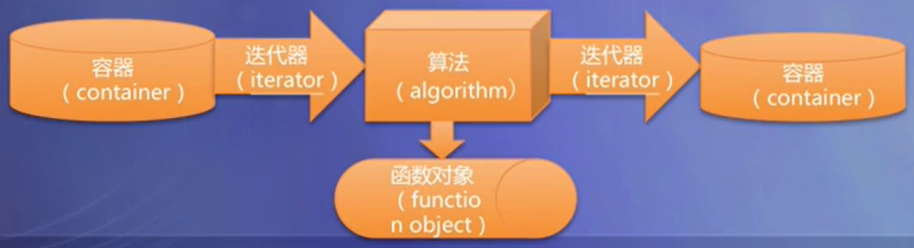
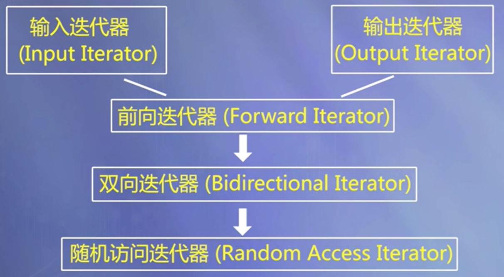
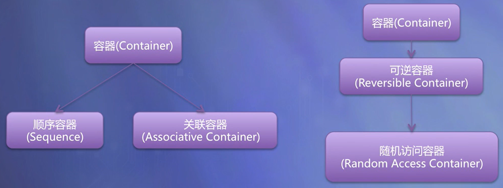
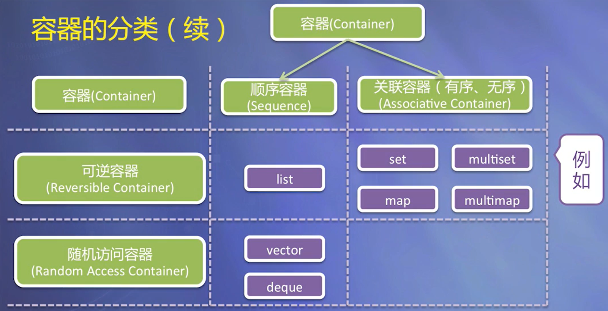

# 泛型程序设计与C++标准模板库

[TOC]

## 泛型程序设计的基本概念

- 编写不依赖于具体数据类型的程序
- 将算法从特定的数据结构中抽象出来，成为通用的
- C++的模板为泛型程序设计奠定了关键的基础

### 术语：概念

- 用来界定具备一定功能的数据类型。例如：

- - 将“可以比大小的所有数据类型（有比较运算符）”这一概念记为**Comparable**
  - 将“具有公有的复制构造函数并可以用‘=’赋值的数据类型”这一概念记为**Assignable**
  - 将“可以比大小、具有公有的复制构造函数并可以用‘=’赋值的所有数据类型”这个概念记作**Sortable**

- 对于两个不同的概念A和B，如果概念A所需求的所有功能也是概念B所需求的功能，那么就说概念B是概念A的子概念。例如：

- - Sortable既是Comparable的子概念，也是Assignable的子概念

### 术语：模型

- 模型（model）：符合一个概念的数据类型称为该概念的模型，例如：

- - `int` 型是Comparable概念的模型。
  - 静态数组类型不是Assignable概念的模型（无法用“=”给整个静态数组赋值）

### 用概念做模板参数名

- 很多STL的实现代码就是使用概念来命名模板参数的。

- 为概念赋予一个名称，并使用该名称作为模板参数名。

- 例如

- - 表示 `insertionSort` 这样一个函数模板的原型：

    ```
    template <class Sortable>
    void insertionSort(Sortable a[], int n);
    ```


## STL 简介

 标准模板库（Standard Template Library，简称STL）提供了一些非常常用的数据结构和算法

### STL简介

- 标准模板库（Standard Template Library，简称STL）定义了一套概念体系，为泛型程序设计提供了逻辑基础
- STL中的各个类模板、函数模板的参数都是用这个体系中的概念来规定的。
- 使用STL的模板时，类型参数既可以是C++标准库中已有的类型，也可以是自定义的类型——只要这些类型是所要求概念的模型。

### STL的基本组件

- 容器（container）
- 迭代器（iterator）
- 函数对象（function object）
- 算法（algorithms）

### STL的基本组件间的关系

- Iterators（迭代器）是算法和容器的桥梁。

- - 将迭代器作为算法的参数、通过迭代器来访问容器而不是把容器直接作为算法的参数。

- 将**函数对象**作为算法的参数而不是将函数所执行的运算作为算法的一部分。

- 使用STL中提供的或自定义的迭代器和函数对象，配合STL的算法，可以组合出各种各样的功能。



### STL的基本组件——容器（container）

- 容纳、包含一组元素的对象。

- 基本容器类模板

  - 顺序容器：array（数组）、vector（向量）、deque（双端队列）、forward_list（单链表）、list（链表）

- - （有序）关联容器：set（集合）、multiset（多重集合）、map（映射）、multimap（多重映射）
  - 无序关联容器：unordered_set （无序集合）、unordered_multiset（无序多重集合）unordered_map（无序映射）、unorder_multimap（无序多重映射）

- 容器适配器

- - stack（栈）、queue（队列）、priority_queue（优先队列）

- 使用容器，需要包含对应的头文件

### STL的基本组件——迭代器（iterator）

- 迭代器是泛化的指针，提供了顺序访问容器中每个元素的方法
- 提供了顺序访问容器中每个元素的方法；
- 可以使用“++”运算符来获得指向下一个元素的迭代器；
- 可以使用“*”运算符访问一个迭代器所指向的元素，如果元素类型是类或结构体，还可以使用“->”运算符直接访问该元素的一个成员；
- 有些迭代器还支持通过“--”运算符获得指向上一个元素的迭代器；
- 迭代器是泛化的指针：指针也具有同样的特性，因此指针本身就是一种迭代器；
- 使用独立于STL容器的迭代器，需要包含头文件 `<iterator>`。

### STL的基本组件——函数对象（function object）

- 一个行为类似函数的对象，对它可以像调用函数一样调用。
- 函数对象是泛化的函数：任何普通的函数和任何重载了“()” 运算符的类的对象都可以作为函数对象使用
- 使用STL的函数对象，需要包含头文件 `<functional>`

### STL的基本组件——算法（algorithms）

- STL包括70多个算法

- - 例如：排序算法，消除算法，计数算法，比较算法，变换算法，置换算法和容器管理等

- 可以广泛用于不同的对象和内置的数据类型。

- 使用STL的算法，需要包含头文件 `<algorithm>`


## 迭代器

- 迭代器是算法和容器的桥梁

- - 迭代器用作访问容器中的元素
  - 算法不直接操作容器中的数据，而是通过迭代器间接操作

- 算法和容器独立

- - 增加新的算法，无需影响容器的实现
  - 增加新的容器，原有的算法也能适用

### 输入流迭代器和输出流迭代器

- 输入流迭代器

  ```
  istream_iterator<T>
  ```

- - 以输入流（如 `cin`）为参数构造
  - 可用 `*(p++)` 获得下一个输入的元素

- 输出流迭代器

  ```
  ostream_iterator<T>
  ```

- - 构造时需要提供输出流（如 `cout`）
  - 可用 `(*p++) = x` 将 x 输出到输出流

- 二者都属于适配器

- - 适配器是用来为已有对象提供新的接口的对象
  - 输入流适配器和输出流适配器为流对象提供了迭代器的接口

### 例子：从标准输入读入几个实数，分别将它们的平方输出

```c++
#include <iterator>
#include <iostream>
#include <algorithm>
using namespace std;

//求平方的函数
double square(double x) {
    return x * x;
}
int main() {
    //从标准输入读入若干个实数，分别将它们的平方输出
    transform(istream_iterator<double>(cin), istream_iterator<double>(),
        ostream_iterator<double>(cout, "\t"), square);
    cout << endl;
    return 0;
}
```

### 迭代器的分类



### 迭代器支持的操作

- 迭代器是泛化的指针，提供了类似指针的操作（诸如 `++`、`*`、`->` 运算符）
- 输入迭代器：可以用来从序列中读取数据，如输入流迭代器
- 输出迭代器：允许向序列中写入数据，如输出流迭代器
- 前向迭代器：既是输入迭代器又是输出迭代器，并且可以对序列进行单向的遍历
- 双向迭代器：与前向迭代器相似，但是在两个方向上都可以对数据遍历
- 随机访问迭代器：也是双向迭代器，但能够在序列中的任意两个位置之间进行跳转，如指针、使用vector的begin()、end()函数得到的迭代器

### 迭代器的区间

- 两个迭代器表示一个区间：`[p1, p2)`
- STL算法常以迭代器的区间作为输入，传递输入数据
- 合法的区间：p1经过n次(n > 0)自增(++)操作后满足p1 == p2
- 区间包含p1，但不包含p2

### 例子：综合运用几种迭代器的示例

程序涉及到输入迭代器、输出迭代器、随机访问迭代器这三个迭代器概念，并且以前两个概念为基础编写了一个通用算法。

```c++
#include <algorithm>
#include <iterator>
#include <vector>
#include <iostream>
using namespace std;

//将来自输入迭代器的n个T类型的数值排序，将结果通过输出迭代器result输出
template <class T, class InputIterator, class OutputIterator>
void mySort(InputIterator first, InputIterator last, OutputIterator result) {
    //通过输入迭代器将输入数据存入向量容器s中
    vector<T> s;
    for (;first != last; ++first)
        s.push_back(*first);
    //对s进行排序，sort函数的参数必须是随机访问迭代器
    sort(s.begin(), s.end());  
    copy(s.begin(), s.end(), result);   //将s序列通过输出迭代器输出
}

int main() {
    //将s数组的内容排序后输出
    double a[5] = { 1.2, 2.4, 0.8, 3.3, 3.2 };
    mySort<double>(a, a + 5, ostream_iterator<double>(cout, " "));
    cout << endl;
    //从标准输入读入若干个整数，将排序后的结果输出
    mySort<int>(istream_iterator<int>(cin), istream_iterator<int>(), ostream_iterator<int>(cout, " "));
    cout << endl;
    return 0;
}
/*
运行结果：
0.8 1.2 2.4 3.2 3.3
2 -4 5 8 -1 3 6 -5
-5 -4 -1 2 3 5 6 8
*/
```

### 迭代器的辅助函数

- `advance(p, n)` ：对p执行n次自增操作
- `distance(first, last)` ：计算两个迭代器first和last的距离，即对first执行多少次“++”操作后能够使得first == last


## 容器的基本功能与分类

- 容器类是容纳、包含一组元素或元素集合的对象。
- 基于容器中元素的组织方式分类：顺序容器、关联容器
- 按照与容器所关联的迭代器类型划分：可逆容器、随机访问容器

### 容器的分类

顺序容器：array（数组）、vector（向量）、deque（双端队列）、forward_list（单链表）、list（链表）

（有序）关联容器：set（集合）、multiset（多重集合）、map（映射）、multimap（多重映射）

无序关联容器：unordered_set （无序集合）、unordered_multiset（无序多重集合）unordered_map（无序映射）、unorder_multimap（无序多重映射）

#### 容器的分类





### 容器的通用功能

- 容器的通用功能

- - 用默认构造函数构造空容器
  - 支持关系运算符：==、!=、<、<=、>、>=
  - begin()、end()：获得容器首、尾迭代器
  - clear()：将容器清空
  - empty()：判断容器是否为空
  - size()：得到容器元素个数
  - s1.swap(s2)：将s1和s2两容器内容交换

- 相关数据类型（S表示容器类型）

- - S::iterator：指向容器元素的迭代器类型
  - S::const_iterator：常迭代器类型

### 对可逆容器的访问

- STL为每个可逆容器都提供了逆向迭代器，逆向迭代器可以通过下面的成员函数得到：

- - rbegin() ：指向容器尾的逆向迭代器
  - rend()：指向容器首的逆向迭代器

- 逆向迭代器的类型名的表示方式如下：

- - S::reverse_iterator：逆向迭代器类型
  - S::const_reverse_iterator：逆向常迭代器类型

### 随机访问容器

- 支持对容器的元素进行随机访问

- - s[n]：获得容器s的第n个元素


## 顺序容器

### 顺序容器的基本功能

#### 顺序容器

- 向量（vector）、双端队列（deque）、链表（list）、单向链表（forward_list） 、数组（array）（前四种在逻辑上可看作是一个长度可扩展的数组）
- 元素线性排列，可以随时在指定位置插入元素和删除元素。
- 必须符合Assignable这一概念（即具有公有的拷贝构造函数并可以用“=”赋值）。
- array对象的大小固定，forward_list有特殊的添加和删除操作。

#### 顺序容器的接口（不包含单向链表（forward_list）和数组（array））

- 构造函数
- 赋值函数：assign
- 插入函数：insert， push_front（只对list和deque），push_back，emplace，emplace_front
- 删除函数：erase，clear，pop_front（只对list和deque） ，pop_back，emplace_back
- 首尾元素的直接访问：front，back
- 改变大小：resize

### 顺序容器的特性

顺序容器：向量、双端队列、链表、单向链表、数组

#### 向量（Vector）

特点：

+ 一个可以扩展的动态数组

+ 随机访问、在尾部插入或删除元素快

+ 在中间或头部插入或删除元素慢

向量的容量：

+ 容量(capacity)：实际分配空间的大小

+ `s.capacity()` ：返回当前容量

+ `s.reserve(n)`：若容量小于n，则对s进行扩展，使其容量至少为n

#### 双端队列（deque）

特点：

- 在两端插入或删除元素快
- 在中间插入或删除元素慢
- 随机访问较快，但比向量容器慢

#### 链表(list)

特点：

- 在任意位置插入和删除元素都很快
  
- 不支持随机访问
  

接合（splice）操作

- `s1.splice(p, s2, q1, q2)`：将s2中[q1, q2)移动到s1中p所指向元素之前

#### 单向链表（forward_list）

- 单向链表每个结点只有指向下个结点的指针，没有简单的方法来获取一个结点的前驱；
- 未定义insert、emplace和erase操作，而定义了insert_after、emplace_after 和 erase_after 操作，其参数与list的insert、emplace和erase相同，但并不是插入或删除迭代器p1所指的元素，而是对p1所指元素之后的结点进行操作；
- 不支持size操作。

#### 数组（array）

- array是对内置数组的封装，提供了更安全，更方便的使用数组的方式
- array的对象的大小是固定的，定义时除了需要指定元素类型，还需要指定容器大小。
- 不能动态地改变容器大小

#### 顺序容器的比较

- STL所提供的顺序容器各有所长也各有所短，我们在编写程序时应当根据我们对容器所需要执行的操作来决定选择哪一种容器。
- 如果需要执行大量的随机访问操作，而且当扩展容器时只需要向容器尾部加入新的元素，就应当选择向量容器vector；
- 如果需要少量的随机访问操作，需要在容器两端插入或删除元素，则应当选择双端队列容器deque；
- 如果不需要对容器进行随机访问，但是需要在中间位置插入或者删除元素，就应当选择链表容器list或forward_list；
- 如果需要数组，array相对于内置数组类型而言，是一种更安全、更容易使用的数组类型。

## 顺序容器的插入迭代器与适配器

### 顺序容器的插入迭代器

- 用于向容器头部、尾部或中间指定位置插入元素的迭代器

- 包括前插迭代器（front_inserter）、后插迭代器（back_inserter）和任意位置插入迭代器（inserter）

- 例：

  ```
  list<int> s;
  back_inserter iter(s);
  *(iter++) = 5; //通过iter把5插入s末尾
  ```

### 顺序容器的适配器

以顺序容器为基础构建一些常用数据结构，是对顺序容器的封装

+ 栈(stack)：最先压入的元素最后被弹出

- 队列(queue)：最先压入的元素最先被弹出
- 优先级队列(priority_queue)：最“大”的元素最先被弹出

### 栈和队列模板

- 栈模板

  ```
  template <class T, class Sequence = deque<T> > class stack;
  ```

- 队列模板

  ```
  template <class T, class FrontInsertionSequence = deque<T> > class queue;
  ```

- 栈可以用任何一种顺序容器作为基础容器，而队列只允许用前插顺序容器（双端队列或链表）

### 栈和队列共同支持的操作

- s1 op s2 op可以是==、!=、<、<=、>、>=之一，它会对两个容器适配器之间的元素按字典序进行比较
- s.size() 返回s的元素个数
- s.empty() 返回s是否为空
- s.push(t) 将元素t压入到s中
- s.pop() 将一个元素从s中弹出，对于栈来说，每次弹出的是最后被压入的元素，而对于队列，每次被弹出的是最先被压入的元素
- 不支持迭代器，因为它们不允许对任意元素进行访问

### 栈和队列不同的操作

- 栈的操作
- s.top() 返回栈顶元素的引用
- 队列操作
  - s.front() 获得队头元素的引用
  - s.back() 获得队尾元素的引用

### 优先级队列

- 优先级队列也像栈和队列一样支持元素的压入和弹出，但元素弹出的顺序与元素的大小有关，每次弹出的总是容器中最“大”的一个元素。

  ```
  template <class T, class Sequence = vector<T> > class priority_queue;
  ```

- 优先级队列的基础容器必须是支持随机访问的顺序容器。

- 支持栈和队列的size、empty、push、pop几个成员函数，用法与栈和队列相同。

- 优先级队列并不支持比较操作。

- 与栈类似，优先级队列提供一个top函数，可以获得下一个即将被弹出元素（即最“大”的元素）的引用。