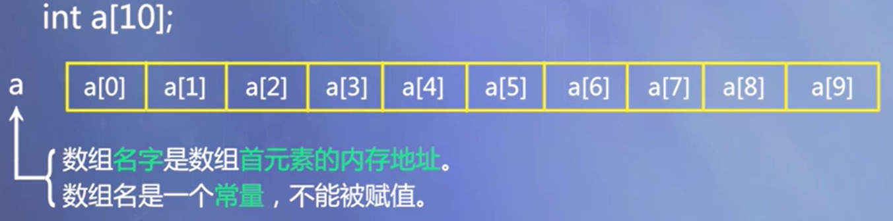
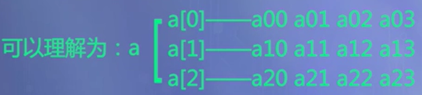
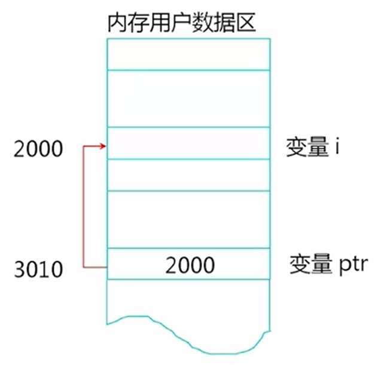
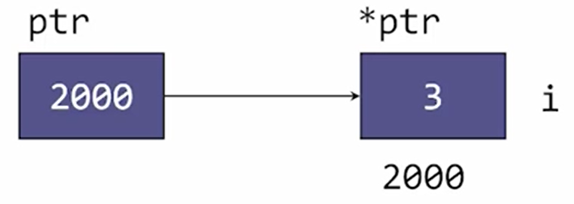
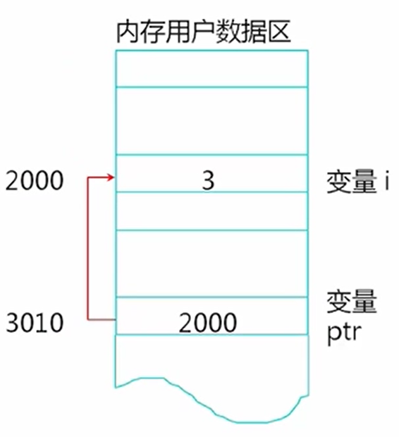
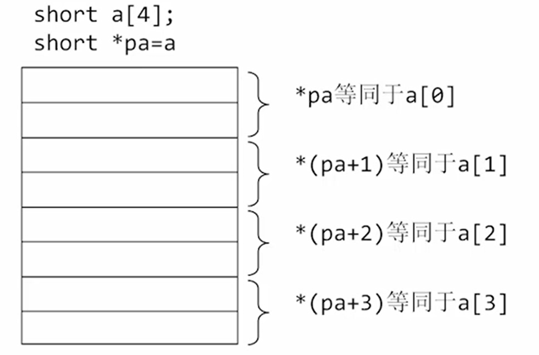
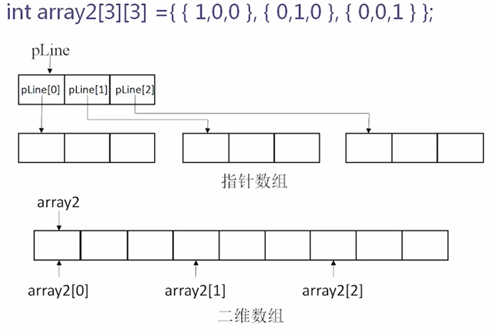
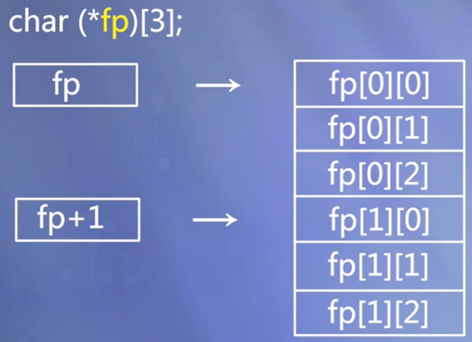

# 复合数据类型

[TOC]

## 引用类型

- 引用(&)是标识符的别名；

- 定义一个引用时，必须同时对它进行初始化，使它指向一个已存在的对象。

- 例如：

  ```c++
  int i, j;
  int &ri = i; //定义int引用ri，并初始化为变量i的引用
  j = 10;
  ri = j; //相当于 i = j;
  ```

- 一旦一个引用被初始化后，就不能改为指向其它对象。

- 引用可以作为形参

一般在初始化变量时，初始值会被拷贝到新建的对象中。然而定义引用时，程序把引用和它的初始值绑定（bind）在一起，而不是将初始值拷贝给引用。一旦初始化完成，引用将和它的初始值对象一直绑定在一起。因为无法令引用重新绑定到另外一个对象，因此引用必须初始化。

```c++
int ival = 1024;
int &refVal = ival;		// refVal 指向 ival（是 ival 的另一个名字）
int &refVal2;			// 报错：引用必须被初始化
```

引用并非对象，它只是为一个已经存在的对象所起的另外一个名字。


## 枚举类型

### 定义方式

将全部可取值一一列举出来。

### 语法形式

```c++
enum 枚举类型名 {变量值列表};
```

例：

```c++
enum Weekday {SUN, MON, TUE, WED, THU, FRI, SAT};
// 默认情况下
// SUN=0，MON=1，TUE=2，......，SAT=6
```

### 特点

不限定作用域。不限定作用域枚举类型说明：

+ 枚举元素是常量，不能对它们赋值

  例如有如下定义：

  ```c++
  enum Weekday {SUN, MON, TUE, WED, THU, FRI, SAT};
  ```

  不能写赋值表达式：`SUN = 0`

+ 枚举元素具有默认值，它们依次为：`0, 1, 2, ...`。

+ 也可以在声明时另行指定枚举元素的值，如：

  ```c++
  enum Weekday{SUN=7,MON=1,TUE,WED, THU,FRI,SAT};
  ```

+ 枚举值可以进行关系运算。

+ 整数值不能直接赋给枚举变量，如需要将整数赋值给枚举变量，应进行强制类型转换。

+ 枚举值可以赋给整型变量。


## 枚举类（C++ 11）

### 枚举类定义

语法形式：

```c++
enum class 枚举类型名:底层类型 {枚举值列表};
```

例：

```c++
enum class Type { General, Light, Medium, Heavy};
enum class Type: char { General, Light, Medium, Heavy};
enum class Category { General=1, Pistol, MachineGun, Cannon};
```

### 枚举类的优势

+ 强作用域，其作用域限制在枚举类中。

  例：使用Type的枚举值General：

  ```c++
  Type::General
  ```

+ 转换限制，枚举类对象不可以与整型隐式地互相转换。

+ 可以指定底层类型

  例：

  ```c++
  enum class Type: char { General, Light, Medium, Heavy};
  ```

### 例子

```c++
#include<iostream>
using namespace std;
enum class Side{ Right, Left };
enum class Thing{ Wrong, Right };  // Thing::Right 与 Side::Right 不冲突
int main()
{
    Side s = Side::Right;
    Thing w = Thing::Wrong;
    cout << (s == w) << endl;  //编译错误，无法直接比较不同枚举类
    return 0;
}
```


## 结构体

- 结构体是一种特殊形态的类

- - 与类的唯一区别：类的缺省访问权限是private，结构体的缺省访问权限是public
  - 结构体存在的主要原因：与C语言保持兼容

- 什么时候用结构体而不用类

- - 定义主要用来保存数据、而没有什么操作的类型
  - 人们习惯将结构体的数据成员设为公有，因此这时用结构体更方便

### 结构体的定义

```c++
struct 结构体名称 {
    公有成员
  protected:
    保护型成员
  private:
    私有成员
};
```

结构体中可以有数据成员和函数成员。

### 结构体的初始化

如果一个结构体的全部数据成员都是公有成员，并且没有用户定义的构造函数，没有基类和虚函数，这个结构体的变量可以用下面的语法形式赋初值

```
类型名 变量名 = { 成员数据1初值, 成员数据2初值, ...};
```


## 联合体

### 定义形式

```c++
union 联合体名称 {
    公有成员
  protected:
    保护型成员
  private:
    私有成员
};
```

### 特点

- 成员共用同一组内存单元
- 任何两个成员不会同时有效

### 无名联合

例：

```c++
union {
  int i;
  float f;
}
```

在程序中可以这样使用：

```c++
i = 10;
f = 2.2;  // i 中的值被冲掉——共用内存空间
```

### 例子

 使用联合体保存成绩信息，并且输出。 

```c++
#include <iostream>
using namespace std;
class ExamInfo {
private:
	string name;	//课程名称
	enum { GRADE, PASS, PERCENTAGE } mode;//计分方式
	union {
		char grade;	//等级制的成绩
		bool pass;	//只记是否通过课程的成绩
		int percent;	//百分制的成绩
	};
public:
	//三种构造函数，分别用等级、是否通过和百分初始化
	ExamInfo(string name, char grade)
		: name(name), mode(GRADE), grade(grade) { }
	ExamInfo(string name, bool pass)
		: name(name), mode(PASS), pass(pass) { }
	ExamInfo(string name, int percent)
		: name(name), mode(PERCENTAGE), percent(percent) { }
	void show();
}

void ExamInfo::show() {
	cout << name << ": ";
	switch (mode) {
	  case GRADE: cout << grade;  break;
	  case PASS: cout << (pass ? "PASS" : "FAIL"); break;
	  case PERCENTAGE: cout << percent; break;
	}
	cout << endl;
}

int main() {
	ExamInfo course1("English", 'B');
	ExamInfo course2("Calculus", true);
	ExamInfo course3("C++ Programming", 85);
	course1.show();
	course2.show();
	course3.show();
	return 0;
}
```

运行结果：

```
English: B
Calculus: PASS
C++ Programming: 85
```


## 数组

数组是具有一定顺序关系的若干相同类型变量的集合体，组成数组的变量称为该数组的元素。

### 数组的定义

```c++
类型说明符 数组名[常量表达式][常量表达式]...;
```

例如：

```c++
int a[10]; 
```

表示 a 为整型数组，有10个元素：a[0]...a[9]

例如:

```c++
int a[5][3];
```

表示 a 为整型二维数组，其中第一维有5个下标（0~4），第二维有3个下标（0~2），数组的元素个数为15，可以用于存放5行3列的整型数据表格。

### 数组的使用

必须先声明，后使用。只能逐个引用数组元素，而不能一次引用整个数组。

例如：

```c++
a[0]=a[5]+a[7]-a[2*3];
b[1][2]=a[2][3]/2;
```

### 一维数组的存储

数组元素在内存中顺次存放，它们的地址是连续的。元素间物理地址上的相邻，对应着逻辑次序上的相邻。

例如：



### 一维数组的初始化

在定义数组时给出数组元素的初始值。

- 列出全部元素的初始值

  例如：static int a[10]={0,1,2,3,4,5,6,7,8,9};

- 可以只给一部分元素赋初值

  例如：static int a[10]={0,1,2,3,4};

- 在对全部数组元素赋初值时，可以不指定数组长度

  例如：static int a[]={0,1,2,3,4,5,6,7,8,9}

### 二维数组的存储

按行存放

例如： 

```c++
float a[3][4];
```

可以理解为：



其中数组a的存储顺序为： $a_{00},a_{01},a_{02},a_{03},a_{10},a_{11},a_{12},a_{13},a_{20},a_{21},a_{22},a_{23}$

### 二维数组的初始化

- 将所有初值写在一个{}内，按顺序初始化。例如：

  ```c++
  static int a[3][4]={1,2,3,4,5,6,7,8,9,10,11,12};
  ```

- 分行列出二维数组元素的初值。例如：

  ```c++
  static int a[3][4]={{1,2,3,4},{5,6,7,8},{9,10,11,12}};
  ```

- 可以只对部分元素初始化。例如：

  ```c++
  static int a[3][4]={{1},{0,6},{0,0,11}};
  ```

- 列出全部初始值时，第1维下标个数可以省略。例如：

  ```c++
  static int a[][4]={1,2,3,4,5,6,7,8,9,10,11,12};
  // 或
  static int a[][4]={{1,2,3,4},{5,6,7,8},{9,10,11,12}};
  ```

- 如果不作任何初始化，局部作用域的非静态数组中会存在垃圾数据，static数组中的数据默认初始化为0；
- 如果只对部分元素初始化，剩下的未显式初始化的元素，将自动被初始化为零；


###  数组作为函数参数 

数组元素作实参，与单个变量一样。

数组名作参数，形、实参数都应是数组名（实质上是地址），类型要一样，传送的是数组首地址。对形参数组的改变会直接影响到实参数组，即可以实现参数的值的双向传递。

#### 例子：使用数组名作为函数参数 

主函数中初始化一个二维数组，表示一个矩阵，矩阵，并将每个元素都输出，然后调用子函数，分别计算每一行的元素之和，将和直接存放在每行的第一个元素中，返回主函数之后输出各行元素的和。 

```c++
#include <iostream>

using namespace std;

void rowSum(int a[][4], int nRow) {     //计算二维数组A每行元素的值的和
    for (int i = 0; i < nRow; i++) {
        for(int j = 1; j < 4; j++)
            a[i][0] += a[i][j];
     }
}

int main() {   //主函数
    //定义并初始化数组
    int table[3][4] = {{1, 2, 3, 4}, {2, 3, 4, 5}, {3, 4, 5, 6}};
    //输出数组元素
    for (int i = 0; i < 3; i++)  {
        for (int j = 0; j < 4; j++)
            cout << table[i][j] << "   ";
        cout << endl;
     }
     rowSum(table, 3);     //调用子函数，计算各行和
    //输出计算结果
    for (int i = 0; i < 3; i++) 
        cout << "Sum of row " << i << " is " << table[i][0] << endl;
    return 0;
}
```


### 对象数组

#### 对象数组的定义与访问

定义对象数组：

```c++
类名 数组名[元素个数];
```

访问对象数组元素：通过下标访问

```c++
数组名[下标].成员名
```

#### 对象数组初始化

数组中每一个元素对象被创建时，系统都会调用类构造函数初始化该对象。

通过初始化列表赋值。

例：

```c++
Point a[2]={Point(1,2),Point(3,4)};
```

如果没有为数组元素指定显式初始值，数组元素便使用默认值初始化（调用默认构造函数）。

#### 数组元素的构造和析构

构造数组时，元素所属的类未声明构造函数，则采用默认构造函数。

各元素对象的初值要求为相同的值时，可以声明具有默认形参值的构造函数。

各元素对象的初值要求为不同的值时，需要声明带形参的构造函数。

当数组中每一个对象被删除时，系统都要调用一次析构函数。

#### 例子：对象数组应用举例

```c++
//Point.h
#ifndef _POINT_H
#define _POINT_H
class Point { //类的定义
  public: //外部接口
    Point();
    Point(int x, int y);
    ~Point();
    void move(int newX,int newY);
    int getX() const { return x; }
    int getY() const { return y; }
    static void showCount(); //静态函数成员
  private: //私有数据成员
    int x, y;
};
#endif //_POINT_H


//Point.cpp
#include <iostream>
#include "Point.h"

using namespace std;

Point::Point() : x(0), y(0) {
    cout << "Default Constructor called." << endl;
}
Point::Point(int x, int y) : x(x), y(y) {
    cout << "Constructor called." << endl;
}
Point::~Point() {
    cout << "Destructor called." << endl;
}
void Point::move(int newX,int newY) {
    cout << "Moving the point to (" << newX << ", " << newY << ")" << endl;
    x = newX;
    y = newY;
}


//main.cpp
#include "Point.h"
#include <iostream>
using namespace std;

int main() {
    cout << "Entering main..." << endl;
    Point a[2];
    for(int i = 0; i < 2; i++)
        a[i].move(i + 10, i + 20);
    cout << "Exiting main..." << endl;
    return 0;
}
```


## 指针

### 指针的概念、定义和指针运算

#### 内存空间的访问方式

- 通过变量名访问
- 通过地址访问

#### 指针的概念

- 指针：内存地址，用于间接访问内存单元
- 指针变量：用于存放地址的变量

#### 指针变量的定义

例：

```c++
static int i;
static int* ptr = &i;  // 指向 int 变量的指针
```



```c++
*ptr = 3;
```





#### 与地址相关的运算——“***”**和“&”

- 指针运算符：*
- 地址运算符：&

### 指针的初始化和赋值

#### 指针变量的初始化

+ 语法形式

  ```c++
  存储类型 数据类型 *指针名＝初始地址;
  ```

+ 例：

  ```c++
  int *pa = &a;
  ```

+ 注意事项
  + 用变量地址作为初值时，该变量必须在指针初始化之前已声明过，且变量类型应与指针类型一致。
  + 可以用一个已有合法值的指针去初始化另一个指针变量。
  + 不要用一个内部非静态变量去初始化 static 指针。

#### 指针变量的赋值运算

- 语法形式

  ```c++
  指针名 = 地址
  ```

- 注意：
  “地址”中存放的数据类型与指针类型必须相符

  向指针变量赋的值必须是地址常量或变量，不能是普通整数
  
+ 例如：
  
  通过地址运算“&”求得已定义的变量和对象的起始地址
  
  动态内存分配成功时返回的地址
- 例外：整数0可以赋给指针，表示空指针。

- 允许定义或声明指向 void 类型的指针。该指针可以被赋予任何类型对象的地址。例： 

  ```c++
  void *general;
  ```

### 指针空值 nullptr（C++ 11）

- 以往用0或者NULL去表达空指针的问题：

  C/C++的NULL宏是个有很多潜在BUG的宏。因为有的库把其定义成整数 0，有的定义成 (void*)0 。在C的时代还好，但是在C++的时代，这就会引发很多问题。

- C++11使用nullptr关键字，是表达更准确，类型安全的空指针

#### 例子：void类型指针的使用 

```c++
#include <iostream>
using namespace std;
int main() {
    //void voidObject; 错，不能声明void类型的变量
    void *pv; //对，可以声明void类型的指针
    int i = 5;
    pv = &i; //void类型指针指向整型变量
    int *pint = static_cast<int *>(pv); //void指针转换为int指针
    cout << "*pint = " << *pint << endl;
    return 0;
}
```

### 指向常量的指针

+ const 指针：只将读取权限授予给了指针，而没有授予指针写权限（可读不可写，只读指针）

+ 不能通过指向常量的指针改变所指对象的值，但指针本身可以改变，可以指向另外的对象。

+ 例：

  ```c++
  int a;
  const int *p1 = &a; //p1是指向常量的指针
  int b;
  p1 = &b; //正确，p1本身的值可以改变
  *p1 = 1; //编译时出错，不能通过p1改变所指的对象
  ```

### 指针类型的常量

若声明指针常量，则指针本身的值不能被改变。

例：

```c++
int a;
int * const p2 = &a;
p2 = &b; //错误，p2是指针常量，值不能改变
```

### 指针的运算

#### 指针类型的算术运算

- 指针与整数的加减运算
- 指针自增（`++`）、自减（`--`）运算

- 指针p加上或减去n

- - 其意义是指针当前指向位置的前方或后方第n个数据的起始位置。

- 指针的 `++`、`--` 运算

- - 意义是指向下一个或前一个完整数据的起始。

- 运算的结果值取决于指针指向的数据类型，总是指向一个完整数据的起始位置。

- 当指针指向连续存储的同类型数据时，指针与整数的加减运算和自增自减才有意义。

#### 指针与整数相加的意义



#### 指针类型的关系运算

- 指向相同类型数据的指针之间可以进行各种关系运算。
- 指向不同数据类型的指针，以及指针与一般整数变量之间的关系运算是无意义的。
- 指针可以和零之间进行等于或不等于的关系运算，以此判断该指针是否为空指针。例如：`p==0` 或 `p!=0`。 

### 指针与数组

#### 用指针访问数组元素

数组是一组连续存储的同类型数据，可以通过指针的算术运算，使指针依次指向数组的各个元素，进而可以遍历数组。

##### 定义指向数组元素的指针

 定义与赋值，例：

```c++
int a[10], *pa;
pa = &a[0]; // 或 pa=a;
```

等效的形式：

经过上述定义及赋值后，`*pa` 就是 `a[0]`，`*(pa+1)` 就是 `a[1]`，... ，`*(pa+i)` 就是 `a[i]`。`a[i]`、      `*(pa+i)`、`*(a+i)`、`pa[i]` 都是等效的。

注意：不能写 `a++`，因为 `a` 是数组首地址，是常量。

#### 指针数组

指针数组：数组的元素类型是指针类型

例：

```c++
Point *pa[2]; // 由 pa[0]、pa[1] 两个指针组成。
```

##### 例子：利用指针数组存放矩阵

```c++
#include <iostream>
using namespace std;
int main() {
    int line1[] = { 1, 0, 0 }; //矩阵的第一行
    int line2[] = { 0, 1, 0 }; //矩阵的第二行
    int line3[] = { 0, 0, 1 }; //矩阵的第三行
    
    //定义整型指针数组并初始化
    int *pLine[3] = { line1, line2, line3 };
    cout << "Matrix test:" << endl;
    //输出矩阵
    for (int i = 0; i < 3; i++) {
        for (int j = 0; j < 3; j++)
            cout << pLine[i][j] << " ";
    cout << endl;
    }
    return 0;
} 
```



二维数组行与行之间连续存放，但是指针数组构成的矩阵就不一定了。

### 指针与函数

#### 以指针作为函数参数

为什么需要用指针做参数？

- 需要数据双向传递时（引用也可以达到此效果）：用指针作为函数的参数，可以使被调函数通过形参指针存取主调函数中实参指针指向的数据，实现数据的双向传递

- 需要传递一组数据，只传首地址运行效率比较高：实参是数组名时形参可以是指针

##### 例子：以指针作为函数参数

读入三个浮点数，将整数部分和小数部分分别输出 

```c++
#include<iostream>
using namespace std;
void splitFloat(float x, int *intPart, float *fracPart) {
    *intPart = static_cast(x); //取x的整数部分
    *fracPart = x - *intPart;  //取x的小数部分
}
int main() {
    cout << "Enter 3 float point numbers:" << endl;
    for(int i = 0; i < 3; i++) {
        float x, f;
        int n;
        cin >> x;
        splitFloat(x, &n, &f);	//变量地址作为实参
        cout << "Integer Part = " << n << " Fraction Part = " << f << endl;
    }
    return 0;
}
```

##### 例子: 指向常量的指针做形参

```c++
#include <iostream>
using namespace std;
const int N = 6;
void print(const int *p, int n);
int main() {
    int array[N];
    for (int i = 0; i < N; i++)
        cin>>array[i];
    print(array, N);
    return 0;
}
void print(const int *p, int n) {
    cout << "{ " << *p;
    for (int i = 1; i < n; i++)
        cout << ", " << *(p+i);
    cout << " }" << endl;
}
```

“最小授权”原则：尽量隐藏细节，保证安全，对外授权够用就好，不要过多授权。

#### 指针类型的函数

若函数的返回值是指针，该函数就是指针类型的函数。

**指针函数的定义形式**

```c++
存储类型 数据类型 *函数名()
{ 
    //函数体语句 
}
```

注意：

不要将非静态局部地址用作函数的返回值。

错误的例子：在子函数中定义局部变量后将其地址返回给主函数，就是非法地址

```c++
int main(){
    int* function();
    int* ptr= function();
    *prt=5; //危险的访问！
    return 0;
} 
int* function(){
    int local=0; //非静态局部变量作用域和寿命都仅限于本函数体内
    return &local;
}//函数运行结束时，变量local被释放
```

返回的指针要确保在主调函数中是有效、合法的地址。

正确的例子： 主函数中定义的数组，在子函数中对该数组元素进行某种操作后，返回其中一个元素的地址，这就是合法有效的地址。

```c++
#include<iostream>
using namespace std;
int main(){
    int array[10]; //主函数中定义的数组
    int* search(int* a, int num);
    for(int i=0; i<10; i++)
        cin>>array[i];
    int* zeroptr= search(array, 10); //将主函数中数组的首地址传给子函数
    return 0;
}
int* search(int* a, int num){ //指针a指向主函数中定义的数组
    for(int i=0; i<num; i++)
        if(a[i]==0)
            return &a[i]; //返回的地址指向的元素是在主函数中定义的
}//函数运行结束时，a[i]的地址仍有效
```

正确的例子： 在子函数中通过动态内存分配new操作取得的内存地址返回给主函数是合法有效的，但是内存分配和释放不在同一级别，要注意不能忘记释放，避免内存泄漏

```c++
#include<iostream>
using namespace std;
int main(){
    int* newintvar();
    int* intptr= newintvar();
    *intptr=5; //访问的是合法有效的地址
    delete intptr; //如果忘记在这里释放，会造成内存泄漏
    return 0;
}
int* newintvar (){
    int* p=new int(); 
    return p; //返回的地址指向的是动态分配的空间
}//函数运行结束时，p中的地址仍有效
```

#### 指向函数的指针

##### 函数指针的定义

定义形式：

```c++
存储类型 数据类型 (*函数指针名)();
```

含义：函数指针指向的是程序代码存储区。

##### 函数指针的典型用途——实现函数回调

- 通过函数指针调用的函数：例如将函数的指针作为参数传递给一个函数，使得在处理相似事件的时候可以灵活地使用不同的方法。
- 调用者不关心谁是被调用者
- 需知道存在一个具有特定原型和限制条件的被调用函数。

##### 函数指针举例

编写一个计算函数compute，对两个整数进行各种计算。有一个形参为指向具体算法函数的指针，根据不同的实参函数，用不同的算法进行计算

编写三个函数：求两个整数的最大值、最小值、加和。分别用这三个函数作为实参，测试compute函数

```c++
#include <iostream>
using namespace std;

int compute(int a, int b, int(*func)(int, int))
{ return func(a, b);}

int max(int a, int b) // 求最大值
{ return ((a > b) ? a: b);}

int min(int a, int b) // 求最小值
{ return ((a < b) ? a: b);}

int sum(int a, int b) // 求和
{ return a + b;}

int main()
{
    int a, b, res;
    cout << "请输入整数a："; cin >> a;
    cout << "请输入整数b："; cin >> b;
    res = compute(a, b, & max); // 不写地址运算符&也可以
    cout << "Max of " << a << " and " << b << " is " << res << endl;
    res = compute(a, b, & min);
    cout << "Min of " << a << " and " << b << " is " << res << endl;
    res = compute(a, b, & sum);
    cout << "Sum of " << a << " and " << b << " is " << res << endl;
}
```

### 对象指针

#### 对象指针定义形式

```c++
类名 *对象指针名;
```
例：

```c++
Point a(5,10);
Piont *ptr;
ptr=&a;
```

#### 通过指针访问对象成员

```c++
对象指针名->成员名
```

例：`ptr->getx();` 相当于 `(*ptr).getx();`

#### this指针

+ 指向当前对象自己

- 隐含于类的每一个非静态成员函数中。

- 指出成员函数所操作的对象。

- - 当通过一个对象调用成员函数时，系统先将该对象的地址赋给this指针，然后调用成员函数，成员函数对对象的数据成员进行操作时，就隐含使用了this指针。

- 例如，Point类的getX函数中的语句：

  ```c++
  return x;
  ```

  相当于：

  ```c++
  return this->x;
  ```

##### 例子：曾经出现过的错误例子

```c++
class A; //前向引用声明
class B {
    A a; //错误：类Fred的声明尚不完善
};
class A {
    B b;
};
```

在 class B 中声明 class A 的对象 a，编译器不知道该给对象 a 多少空间，所以会报错。

##### 例子：正确的程序

```c++
class A; //前向引用声明
class B {
    A *pa; 
};
class A {
    B b;
};
```

只是为了说明语法现象，现实中需要两个类包含彼此对象的情况很少。

### 动态内存分配

#### 动态申请内存操作符 new

```c++
new 类型名T(初始化参数列表)
```

- 功能：在程序执行期间，申请用于存放T类型对象的内存空间，并依初值列表赋以初值。

- 结果值：

  成功：T类型的指针，指向新分配的内存；失败：抛出异常。

#### 释放内存操作符delete

```c++
delete 指针p
```

- 功能：释放指针p所指向的内存。p必须是new操作的返回值。

+ 注意：删除的是指针p所指向的对象，释放该对象所占的内存空间，而不是删除指针变量本身。该指针变量完全可以继续使用，指向同类型的其它对象。

#### 分配和释放动态数组

分配：

```c++
new 类型名T [数组长度]
```

数组长度可以是任何表达式，在运行时计算

释放：

````c++
delete[] 数组名p
````

释放指针p所指向的数组。p必须是用new分配得到的数组首地址。  

注意：delete 后面要有 `[]` ，否则只会释放数组首元素的地址。

#### 动态创建多维数组

```c++
new 类型名T[第1维长度][第2维长度]...;
```

如果内存申请成功，new运算返回一个指向新分配内存首地址的指针。例如：

```c++
char (*fp)[3]; 
fp = new char[2][3];  
```



##### 例子：动态创建多维数组

```c++
#include <iostream>
using namespace std;
int main() {
    int (*cp)[9][8] = new int[7][9][8]; // cp 是指向9*8的二维数组的指针
    for (int i = 0; i < 7; i++)
        for (int j = 0; j < 9; j++)
            for (int k = 0; k < 8; k++)
                *(*(*(cp + i) + j) + k) =（i * 100 + j * 10 + k);
    for (int i = 0; i < 7; i++) {
        for (int j = 0; j < 9; j++) {
            for (int k = 0; k < 8; k++)
                // cp[i][j][k] 与 *(*(*(cp + i) + j) + k) 等价
                cout << cp[i][j][k] << " "; 
            cout << endl;
        }
        cout << endl;
    }
    delete[] cp;
    return 0;
}
```

#### 将动态数组封装成类

- 更加简洁，便于管理
- 可以在访问数组元素前检查下标是否越界

```c++
#include <iostream>
#include <cassert>
using namespace std;
class Point { 
  public:
    Point() : x(0), y(0) {
        cout<<"Default Constructor called."<<endl;
    }
    Point(int x, int y) : x(x), y(y) {
        cout<< "Constructor called."<<endl;
    } 
    ~Point() { cout<<"Destructor called."<<endl; }
    int getX() const { return x; }
    int getY() const { return y; }
    void move(int newX, int newY) {
        x = newX;
        y = newY;
    }
  private:
    int x, y;
};
class ArrayOfPoints { //动态数组类
  public:
    ArrayOfPoints(int size) : size(size) {
        points = new Point[size];
    }
    ~ArrayOfPoints() {
        cout << "Deleting..." << endl;
        delete[] points;
    }
    Point& element(int index) { 			// 返回值是 Point 引用类型
        assert(index >= 0 && index < size);
        return points[index];
    }
  private:
    Point *points; //指向动态数组首地址
    int size; //数组大小
};
int main() {
    int count;
    cout << "Please enter the count of points: ";
    cin >> count;
    ArrayOfPoints points(count); //创建数组对象
    points.element(0).move(5, 0); //访问数组元素的成员
    points.element(1).move(15, 20); //访问数组元素的成员
    return 0;
} 
```

**为什么 element 函数返回对象的引用？** 

返回“引用”可以用来操作封装数组对象内部的数组元素。如果返回“值”则只是返回了一个“副本”，通过“副本”是无法操作原来数组中的元素的。 

### 智能指针

- 显式管理内存在性能上有优势，但容易出错。
- C++11 提供智能指针的数据类型，对垃圾回收技术提供了一些支持，实现一定程度的内存管理

#### C++11的智能指针

- `unique_ptr` ：不允许多个指针共享资源，可以用标准库中的move函数转移指针
- `shared_ptr` ：多个指针共享资源
- `weak_ptr` ：可复制 `shared_ptr`，但其构造或者释放对资源不产生影响


## vector 对象

### 为什么需要vector？

- 封装任何类型的动态数组，自动创建和删除。

- 数组下标越界检查。

### vector 对象的定义

```c++
vector<元素类型> 对象名(数组长度);
```

例：

```c++
vector<int> arr(5)
```

### vector 对象的使用

#### 对 vector 元素的引用

与普通数组具有相同形式：

```c++
vector对象名[下标表达式]
```

vector 对象名不表示 vector 首地址

#### 获得 vector 长度

用 `size()` 函数

```
vector对象名.size()
```


## 字符串

### C 风格字符串

#### 字符串常量

- 例："program"

- 各字符连续、顺序存放，每个字符占一个字节，以 `\0` 结尾，相当于一个隐含创建的字符常量数组

- “program”出现在表达式中，表示这一char数组的首地址

- 首地址可以赋给char常量指针：

  ```c++
  const char *STRING1 = "program";
  ```

#### 用字符数组存储字符串（C风格字符串）

例如：

```c++
char str[8] = { 'p', 'r', 'o', 'g', 'r', 'a', 'm', '\0' };
char str[8] = "program";
char str[] = "program";
```


#### 用字符数组表示字符串的缺点

- 执行连接、拷贝、比较等操作，都需要显式调用库函数，很麻烦
- 当字符串长度很不确定时，需要用new动态创建字符数组，最后要用delete释放，很繁琐
- 字符串实际长度大于为它分配的空间时，会产生数组下标越界的错误

### string类

- 使用字符串类string表示字符串
- string实际上是对字符数组操作的封装

#### string 类常用的构造函数

+ `string();` 默认构造函数，建立一个长度为 0 的串

  例：

  ```c++
  string s1;
  ```

- `string(const char *s);` 用指针s所指向的字符串常量初始化string对象

  例：

  ```c++
  string s2 = “abc”;
  ```

- `string(const string& rhs);` 复制构造函数

  例：

  ```c++
  string s3 = s2;
  ```

#### string类常用操作

- `s + t` 将串 `s` 和 `t` 连接成一个新串

- `s = t` 用 `t` 更新 `s`

- `s == t` 判断 `s` 与 `t` 是否相等

- `s != t`  判断 `s` 与 `t` 是否不等

- `s < t` 判断 `s` 是否小于 `t`（按字典顺序比较）

- `s <= t` 判断 `s` 是否小于或等于 `t` （按字典顺序比较）

- `s > t` 判断 `s` 是否大于 `t` （按字典顺序比较）

- `s >= t` 判断 `s` 是否大于或等于 `t` （按字典顺序比较）

- `s[i]` 访问串中下标为i的字符

- 例：

  ```c++
  string s1 = "abc", s2 = "def";
  string s3 = s1 + s2; //结果是"abcdef"
  bool s4 = (s1 < s2); //结果是true
  char s5 = s2[1]; 	 //结果是'e'
  ```

  

#### 输入整行字符串

**考虑：如何输入整行字符串？**

- 用cin的>>操作符输入字符串，会以空格作为分隔符，空格后的内容会在下一回输入时被读取

- getline可以输入整行字符串（要包含 string 头文件），例如：

  ```c++
  getline(cin, s2);
  ```

- 输入字符串时，可以使用其它分隔符作为字符串结束的标志（例如逗号、分号），将分隔符作为getline的第3个参数即可，例如：

  ```c++
  getline(cin, s2, ',');
  ```

  