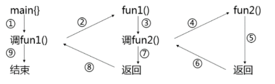

# 函数

[TOC]

## 函数定义

### 函数

函数：定义好的、可重用的功能模块

定义函数：将一个模块的算法用C++描述出来

函数名：功能模块的名字

函数的参数：计算所需要的数据和条件

函数的返回值：需要返回的计算结果

### 函数定义的语法形式

```c++
类型标识符 函数名(形式参数表){
    语句序列
}
```

形式参数表：`<type1> name1`, `<type2> name2`, ..., `<type n> name n` 是被初始化的内部变量，寿命和可见性仅限于函数内部。 

语句序列：程序要执行的操作序列，最后一句是 return 语句

类型标识符：表示返回值类型，由 return 语句给出返回值。若无返回值，写void，不必写 return 语句。

#### void 函数

void 函数：没有返回值的函数。

```c++
void functionName(parameterList){
    statement(s)
    return;			// optional
}
```

#### 有返回值的函数

通用格式如下：

```c++
typeName functionName(parameterList){
    statement(s)
    return value;			// optional
}
```

对于有返回值的函数，必须使用返回语句，以便将值返回给调用函数。值本身可以是常量、变量，也可以是表达式，只是其结果的类型必须为 typeName 类型或可以被转换为 typeName（例如，如果声明的返回类型为 double，而函数返回一个 int 表达式，则该 int 值将被强制转换为 double 类型）。

C++ 对于返回值的类型有一定限制：不能是数组，但可以是其它任何类型——整数、浮点数、指针，甚至可以是结构和对象。而且虽然 C++ 函数不能直接返回数组，但可以将数组作为结构或对象的组成部分来返回。

## 函数调用

### 调用函数需要先声明函数原型

若函数定义在调用点之前，可以不另外声明。若函数定义在调用点之后，必须要在调用函数前声明函数原型，通用格式如下：

```c++
类型标识符 被调用函数名(含类型说明的形参表);
```

### 函数调用形式

```c++
函数名(实参列表);
```

### 嵌套调用

 在一个函数的函数体中，调用另一函数。 

  

#### 递归调用

函数直接或间接调用自身


## 函数的参数传递

- 在函数被调用时才分配形参的存储单元
- 实参可以是常量、变量或表达式
- 实参类型必须与形参相符
- 值传递是传递参数值，即单向传递
- 引用传递可以实现双向传递
- 常引用作参数可以保障实参数据的安全：既能够单向传递，还能够节省传参带来的开销


## 内联函数

+ 声明时使用关键字 inline。
+ 编译时在调用处用函数体进行替换，节省了参数传递、控制转移等开销。
+ 注意：
  + 内联函数体内不能有循环语句和switch语句；
  + 内联函数的定义必须出现在内联函数第一次被调用之前；
  + 对内联函数不能进行异常接口声明。


## constexpr 函数（常量表达式函数）

### 语法规定

+ constexpr 修饰的函数在其所有参数都是 constexpr 时，一定返回constexpr；
+ 函数体中必须有且仅有一条return语句。

### 举例

```c++
constexpr int get_size() { return 20; }
constexpr int foo = get_size();  //正确：foo是一个常量表达式
```


## 带默认参数值的函数

### 默认参数值

可以预先设置默认的参数值，调用时如给出实参，则采用实参值，否则采用预先设置的默认参数值。

例：

```c++
int add(int x = 5,int y = 6) {
     return x + y;
}
int main() {
     add(10,20);  //10+20
     add(10);     //10+6
     add();       //5+6
}
```

### 默认参数值的说明次序

有默认参数的形参必须列在形参列表的最右，即默认参数值的右面不能有无默认值的参数；

调用时实参与形参的结合次序是从左向右。

例：

```c++
int add(int x, int y = 5, int z = 6);//正确
int add(int x = 1, int y = 5, int z);//错误
int add(int x = 1, int y, int z = 6);//错误
```

### 默认参数值与函数的调用位置
如果一个函数有原型声明，且原型声明在定义之前，则默认参数值应在函数原型声明中给出；如果只有函数的定义，或函数定义在前，则默认参数值可以函数定义中给出。

例1：

```c++
int add(int x = 5, int y = 6);
// 原型声明在前
int main(){
    add();
}
int add(int x, int y){
    // 此处不能再指定默认值
    return x + y;
}
```

例2：

```c++
int add(int x = 5, int y = 6){
    //只有定义，没有原型声明
    return x + y;
}
int main(){
    add();
}
```


## 函数重载

C++允许功能相近的函数在相同的作用域内以相同函数名声明，从而形成重载。方便使用，便于记忆。

形参类型不同，例如：

```c++
int add(int x, int y);
float add(float x, float y);
```

形参个数不同，例如：

```c++
int add(int x, int y);
int add(int x, int y, int z);
```

注意事项：

+ 重载函数的形参必须不同:个数不同或类型不同。

+ 编译程序将根据实参和形参的类型及个数的最佳匹配来选择调用哪一个函数。

  ```c++
  int add(int x, int y);
  int add(int a, int b);  // 不能实现重载：编译器不以形参名来区分
  void add(int x, int y); // 不能实现重载：编译器不以返回值来区分
  ```

+ 不要将不同功能的函数声明为重载函数，以免出现调用结果的误解、混淆。这样不好：

  ```c++
  int add(int x, int y){
      return x + y;
  }
  float add(float x, float y){
      return x - y;
  }
  ```

  

