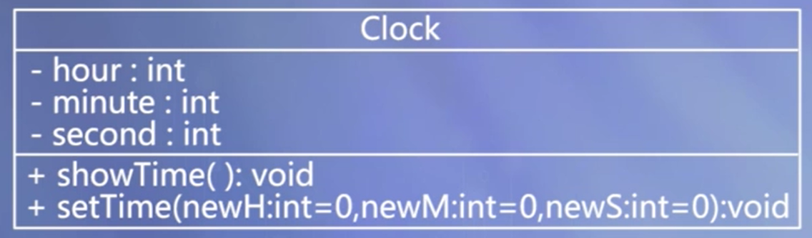
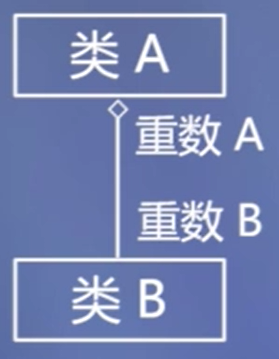
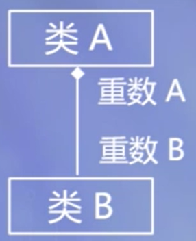
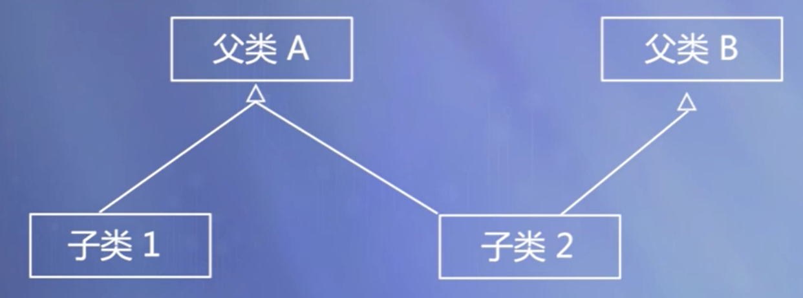
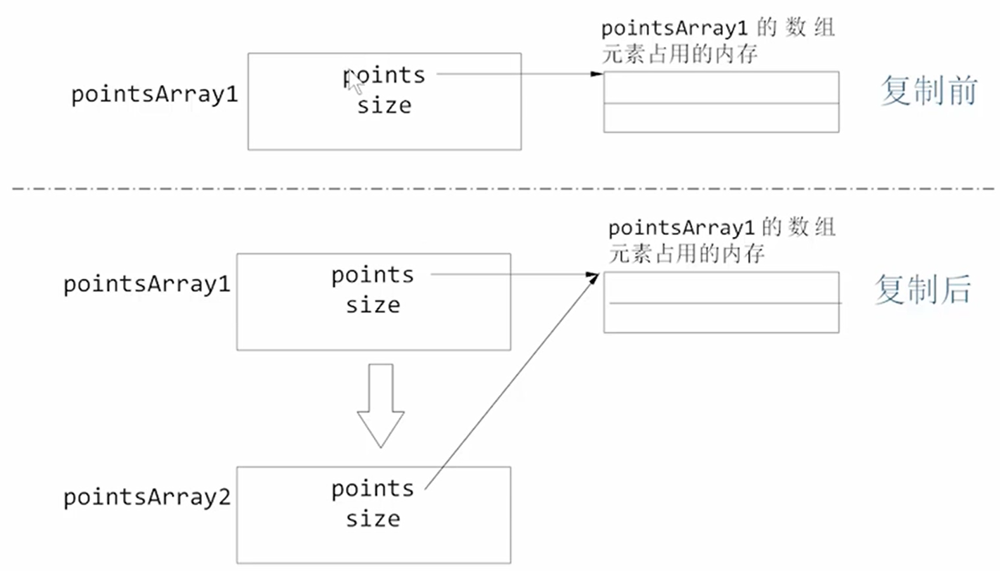
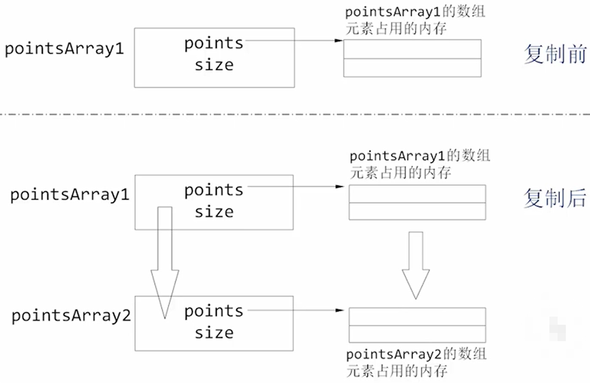
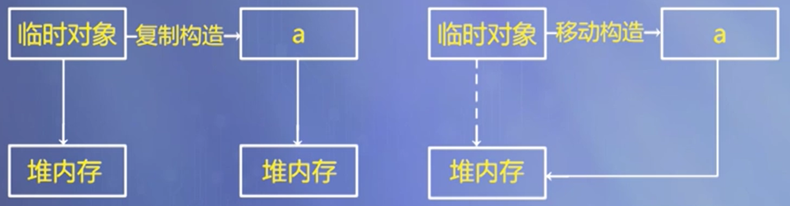

# 类与对象

[TOC]

+ 程序中的对象是现实中对象的模拟，具有属性和功能/行为；
+ 抽象出同一类对象的共同属性和行为，形成类，对象是类的实例；
+ 类将数据和处理数据的函数封装在一起，隐藏内部细节，提供对外访问接口；
+ 定义对象时，可以通过构造函数进行初始化；
+ 删除对象时，可以通过析构函数释放资源；
+ 一个类的对象可以由其他类的对象组合而成，即类的成员可以是其他类的对象。


## 面向对象程序设计的基本特点

### 抽象

对同一类对象的共同属性和行为进行概括，形成类。

+ 先注意问题的本质及描述，其次是实现过程或细节。
+ 数据抽象：描述某类对象的属性或状态（对象之间相互区别的物理量）。
+ 代码抽象：描述某类对象的共有的行为特征或具有的功能。
+ 抽象的实现：类。

### 封装

将抽象出的数据、代码封装在一起，形成类。

目的：增强安全性和简化编程，使用者不必了解具体的实现细节，而只需要通过外部接口，以特定的访问权限，来使用类的成员。

实现封装：类声明中的 `{}`

### 继承

在已有类的基础上，进行扩展形成新的类。

### 多态

+ 多态：同一名称，不同的功能实现方式。
+ 目的：达到行为标识统一，减少程序中标识符的个数。
+ 实现：重载函数和虚函数


## 类和对象的定义

对象是现实中的对象在程序中的模拟。

类是同一类对象的抽象，对象是类的某一特定实体。

定义类的对象，才可以通过对象使用类中定义的功能。

### 设计类就是设计类型

+ 此类型的“合法值”是什么？
+ 此类型应该有什么样的函数和操作符？
+ 新类型的对象该如何被创建和销毁？
+ 如何进行对象的初始化和赋值？
+ 对象作为函数的参数如何以值传递？
+ 谁将使用此类型的对象成员？

### 类定义的语法形式

```c++
class 类名称
{
   public:
    公有成员（外部接口）
   private:
    私有成员
   protected:
    保护型成员
};
```

### 类内初始值

+ 可以为数据成员提供一个类内初始值

+ 在创建对象时，类内初始值用于初始化数据成员

+ 没有初始值的成员将被默认初始化。

+ 举例：

  ```c++
  class Clock {
  public:
     void setTime(int newH, int newM, int newS);
     void showTime();
  private:
     int hour = 0, minute = 0, second = 0;
  };
  ```

  上例中，`hour = 0, minute = 0, second = 0` 即类内初始值。如果有构造函数对 hour、minute、second 变量进行初始化，则按构造函数指定的值进行初始化；否则按照类内初始值对这些变量进行初始化。

### 类成员的访问控制

+ 公有类型成员：在关键字public后面声明，它们是类与外部的接口，任何外部函数都可以访问公有类型数据和函数。

+ 私有类型成员
  + 在关键字private后面声明，只允许本类中的函数访问，而类外部的任何函数都不能访问。
  + 如果紧跟在类名称的后面声明成员，默认其为私有成员，即关键字private可以省略。

+ 保护类型成员：与private类似，其差别表现在继承与派生时对派生类的影响不同。

### 对象定义的语法

```c++
className objectName;
```

### 类成员的访问权限

类中成员互相访问：直接使用成员名访问

类外访问：使用 `objectName.memberName` 方式访问 public 属性的成员

### 类的成员函数

在类中说明函数原型；

可以在类外给出函数体实现，并在函数名前使用类名加以限定；

也可以直接在类中给出函数体，形成内联成员函数；

允许声明重载函数和带默认参数值的函数。

### 内联成员函数

为了提高运行时的效率，对于较简单的函数可以声明为内联形式。

内联函数体中不要有复杂结构（如循环语句和switch语句）。

在类中声明内联成员函数的两种方式：

+ 直接将函数体放在类的声明中（即类体中）。

+ 在类体中声明函数原型，在类体外实现函数体时使用inline关键字。


## 构造函数

### 基本概念

+ 类中的特殊函数
+ 用于描述初始化算法

#### 构造函数的作用

在对象被创建时使用特定的值构造对象，将对象初始化为一个特定的初始状态。

例如：希望在构造一个Clock类对象时，将初始时间设为 0:0:0，就可以通过构造函数来设置。  

#### 构造函数的形式

函数名与类名相同；

不能定义返回值类型，也不能有return语句；

可以有形式参数，也可以没有形式参数；

可以是内联函数；

可以重载；

可以带默认参数值。 

#### 构造函数的调用时机

在对象创建时被自动调用。

例如： 

```c++
Clock myClock(0,0,0); 
```

#### 默认构造函数

调用时可以不需要实参的构造函数

+ 参数表为空的构造函数
+ 全部参数都有默认值的构造函数

下面两个都是默认构造函数，如在类中同时出现，将产生编译错误：

```c++
Clock(); 
Clock(int newH=0,int newM=0,int newS=0); 
```

#### 隐含生成的构造函数

如果程序中未定义构造函数，编译器将在需要时自动生成一个默认构造函数：

+ 参数列表为空，不为数据成员设置初始值；

+ 如果类内定义了成员的初始值，则使用内类定义的初始值；

+ 如果没有定义类内的初始值，则以默认方式初始化；

+ 基本类型的数据默认初始化的值是不确定的。

#### “=default” 

如果程序中已定义构造函数，默认情况下编译器就不再隐含生成默认构造函数。如果此时依然希望编译器隐含生成默认构造函数，可以使用“=default”。 

例如：

```c++
class Clock{ 
    public: 
    	Clock() = default; //指示编译器提供默认构造函数 
    	Clock(int newH, int newM, int newS); //构造函数 
    private: 
    	int hour, minute, second; 
}; 
```

### 委托构造函数

类中往往有多个构造函数，只是参数表和初始化列表不同，其初始化算法都是相同的， 这时，为了避免代码重复，可以使用委托构造函数。 

#### 回顾

Clock类的两个构造函数： 

```c++
Clock(int newH, int newM, int newS) : hour(newH),minute(newM), second(newS) 
{ //构造函数 
} 
Clock::Clock(): hour(0),minute(0),second(0) { }//默认构造函数 
```

#### 委托构造函数

委托构造函数使用类的其他构造函数执行初始化过程

例如： 

```
Clock(int newH, int newM, int newS): hour(newH),minute(newM), second(newS){ } Clock(): Clock(0, 0, 0) { } 
```

上例中，第二个构造函数，即无参数的构造函数，调用了第一个构造函数（有参数的构造函数）。

### 复制构造函数

#### 复制构造函数定义

复制构造函数是一种特殊的构造函数，其形参为本类的对象引用。作用是用一个已存在的对象去初始化同类型的新对象。

```c++
class 类名 {
    public:
    	类名(形参);//构造函数
        类名(const 类名 &对象名);//复制构造函数，const 关键字防止被复制对象被修改
    //   ...
};

类名::类(const 类名&对象名) //复制构造函数的实现
{  函数体  }
```

#### 复制构造函数被调用的三种情况

+ 定义一个对象时，以本类另一个对象作为初始值，发生复制构造；
+ 如果函数的形参是类的对象，调用函数时，将使用实参对象初始化形参对象，发生复制构造；
+ 如果函数的返回值是类的对象，函数执行完成返回主调函数时，将使用return语句中的对象初始化一个临时无名对象，传递给主调函数，此时发生复制构造。
  + 这种情况也可以通过移动构造避免不必要的复制

#### 隐含的复制构造函数

如果程序员没有为类声明拷贝初始化构造函数，则编译器自己生成一个隐含的复制构造函数。

这个构造函数执行的功能是：用作为初始值的对象的每个数据成员的值，初始化将要建立的对象的对应数据成员。

#### “=delete”

如果不希望对象被复制构造：

+ C++98做法：将复制构造函数声明为private，并且不提供函数的实现。

+ C++11做法：用“=delete”指示编译器不生成默认复制构造函数。

例：

```c++
class Point {  //Point 类的定义
    public:
    	Point(int xx=0, int yy=0) { x = xx; y = yy; }  //构造函数，内联
    	Point(const Point& p) =delete; //指示编译器不生成默认复制构造函数
    private:
    	int x, y; //私有数据
};
```


## 析构函数

- 完成对象被删除前的一些清理工作。
- 在对象的生存期结束的时刻系统自动调用它，然后再释放此对象所属的空间。
- 如果程序中未声明析构函数，编译器将自动产生一个默认的析构函数，其函数体为空。

### 析构函数的原型

```c++
~className();
```

析构函数没有参数，没有返回类型，没有 return 语句


## 类的组合

### 组合的概念

- 类中的成员是另一个类的对象。
- 可以在已有抽象的基础上实现更复杂的抽象。

### 类组合的构造函数设计

- 原则：不仅要负责对本类中的基本类型成员数据初始化，也要对对象成员初始化。

- 声明形式：

  ```c++
  类名::类名(对象成员所需的形参, 本类成员形参):对象1(参数)，对象2(参数), ......
  {
  //函数体其他语句
  }
  ```

### 构造组合类对象时的初始化次序

- 首先对构造函数初始化列表中列出的成员（包括基本类型成员和对象成员）进行初始化，初始化次序是成员在类体中定义的次序。

- - 成员对象构造函数调用顺序：按对象成员的声明顺序，先声明者先构造。
  - 初始化列表中未出现的成员对象，调用默认构造函数（即无形参的）初始化

- 处理完初始化列表之后，再执行构造函数的函数体。

### 前向引用声明

+ 类应该先声明，后使用
+ 如果需要在某个类的声明之前，引用该类，则应进行前向引用声明。
+ 前向引用声明只为程序引入一个标识符，但具体声明在其他地方。

+ 例：

  ```c++
  class B;  //前向引用声明
  class A {
      public:
      	void f(B b);
  };
  class B {
  	public:
      	void g(A a);
  };
  ```

#### 前向引用声明注意事项

+ 在提供一个完整的类声明之前，不能声明该类的对象，也不能在内联成员函数中使用该类的对象。

+ 当使用前向引用声明时，只能使用被声明的符号，而不能涉及类的任何细节。

+ 例：

  ```c++
  class Fred; //前向引用声明
  class Barney {
     Fred x; //错误：类Fred的声明尚不完善
  };
  class Fred {
     Barney y;
  };
  ```

  

## UML 简介

### 三个基本部分

+ 事物（Things）
+ 关系（Relationships）
+ 图（Diagrams）

### 类图

举例：

Clock 类的完整表示：

Clock 类的简洁表示：


### 对象图

举例：

Clock类对象的完整表示：


Clock类对象的简洁表示：


### 依赖关系


图中的“类A”是源，“类B”是目标，表示“类A”使用了“类B”，或称“类A”依赖“类B”。

### 关联关系


图中的“重数A”决定了类B的每个对象与类A的多少个对象发生作用，同样“重数B”决定了类A的每个对象与类B的多少个对象发生作用。

### 包含关系——聚集

共享聚集：部分可以参加多个整体。



组成聚集（组合）：整体拥有各个部分，整体与部分共存，如果整体不存在了，部分也就不存在了。



### 继承关系——泛化



### 注释


## 对象复制与移动

### 浅层复制与深层复制

- 浅层复制：实现对象间数据元素的一一对应复制。
- 深层复制：当被复制的对象数据成员是指针类型时，不是复制该指针成员本身，而是将指针所指对象进行复制。

#### 例子：对象的浅层复制

```c++
#include <iostream>
#include <cassert>

using namespace std;

class Point {
  public:
    Point() : x(0), y(0) {
        cout<<"Default Constructor called."<<endl;
    }
    Point(int x, int y) : x(x), y(y) {
        cout<< "Constructor called."<<endl;
    } 
    ~Point() { cout<<"Destructor called."<<endl; }
    int getX() const { return x; }
    int getY() const { return y; }
    void move(int newX, int newY) {
        x = newX;
        y = newY;
    }
  private:
    int x, y;
};

class ArrayOfPoints {
  public:
    ArrayOfPoints(int size) : size(size) {
        points = new Point[size];
    }
    ~ArrayOfPoints() {
        cout << "Deleting..." << endl;
        delete[] points;
    }
    Point& element(int index) {
        assert(index >= 0 && index < size);
        return points[index];
    }
  private:
    Point *points; //指向动态数组首地址
    int size; //数组大小 
};

int main() {
    int count;
    cout << "Please enter the count of points: ";
    cin >> count;
    ArrayOfPoints pointsArray1(count); //创建对象数组
    pointsArray1.element(0).move(5,10);
    pointsArray1.element(1).move(15,20);
    
    ArrayOfPoints pointsArray2(pointsArray1); //创建副本
    
    cout << "Copy of pointsArray1:" << endl;
    cout << "Point_0 of array2: " << pointsArray2.element(0).getX() << ", "
        << pointsArray2.element(0).getY() << endl;
    cout << "Point_1 of array2: " << pointsArray2.element(1).getX() << ", "
        << pointsArray2.element(1).getY() << endl;
    
    pointsArray1.element(0).move(25, 30);
    pointsArray1.element(1).move(35, 40);
    
    cout<<"After the moving of pointsArray1:"<<endl;
    cout << "Point_0 of array2: " << pointsArray2.element(0).getX() << ", "
        << pointsArray2.element(0).getY() << endl;
    cout << "Point_1 of array2: " << pointsArray2.element(1).getX() << ", "
        << pointsArray2.element(1).getY() << endl;
    
    return 0;
}
```

运行结果如下：

```c++
Please enter the number of points:2
Default Constructor called.
Default Constructor called.
Copy of pointsArray1:
Point_0 of array2: 5, 10
Point_1 of array2: 15, 20
After the moving of pointsArray1:
Point_0 of array2: 25, 30        // 对 pointsArray1 的元素修改后，
Point_1 of array2: 35, 40		 // pointsArray2 中的元素也随之变化
Deleting...
Destructor called.
Destructor called.
Deleting...
接下来程序出现运行错误。			// 析构了两个 Point 类的对象后，程序出错
```



我们在进行复制构造时，使用的是默认的复制构造函数。pointsArray2.points 是对 pointsArray1.points 的完全原样复制，也就是说 pointsArray1.points 与 pointsArray2.points 指向的是相同的数组内存单元，数组本身没有被复制。因此，同一个数组内存单元被 delete 了两次，所以在第二次 delete 时报错。

#### 例子：对象的深层复制

```c++
#include <iostream>
#include <cassert>

using namespace std;

class Point {
  //类的声明同“例子：对象的浅层复制”
};

class ArrayOfPoints {
  public:
    ArrayOfPoints(const ArrayOfPoints& pointsArray); 
    //其他成员同“例子：对象的浅层复制”
};
ArrayOfPoints::ArrayOfPoints(const ArrayOfPoints& v) {
    size = v.size;
    points = new Point[size];
    for (int i = 0; i < size; i++)
        points[i] = v.points[i];
} 

int main() {
    // 同“例子：对象的浅层复制”
}
```

程序的运行结果如下：

```c++
Please enter the number of points:2
Default Constructor called.
Default Constructor called.
Default Constructor called.
Default Constructor called.
Copy of pointsArray1:
Point_0 of array2: 5, 10
Point_1 of array2: 15, 20
After the moving of pointsArray1:
Point_0 of array2: 5, 10			// 对 pointsArray1 的元素修改后，
Point_1 of array2: 15, 20			// pointsArray2 中的元素没有改变
Deleting...
Destructor called.
Destructor called.
Deleting...
Destructor called.
Destructor called. 				   // 顺利完成了四次析构
```



### 移动构造

在现实中有很多这样的例子，我们将钱从一个账号转移到另一个账号，将手机SIM卡转移到另一台手机，将文件从一个位置剪切到另一个位置……移动构造可以减少不必要的复制，带来性能上的提升。

- C++11标准中提供了一种新的构造方法——移动构造。
- C++11之前，如果要将源对象的状态转移到目标对象只能通过复制。在某些情况下，我们没有必要复制对象——只需要移动它们。
- C++11引入移动语义：源对象资源的控制权全部交给目标对象
- 移动构造函数

#### 问题与解决

- 当临时对象在被复制后，就不再被利用了。我们完全可以把临时对象的资源直接移动，这样就避免了多余的复制操作。

  

#### 移动构造

- 什么时候该触发移动构造？

  有可被利用的临时对象

- 移动构造函数：

  ```c++
  class_name(class_name &&)
  ```

#### 例子：函数返回含有指针成员的对象

##### 使用深层复制构造函数（版本 1）

返回时构造临时对象，动态分配将临时对象返回到主调函数，然后删除临时对象。

```c++
#include<iostream>

using namespace std;

class IntNum {
  public:
    IntNum(int x = 0) : xptr(new int(x)){ //构造函数
        cout << "Calling constructor..." << endl;
    }
    IntNum(const IntNum & n) : xptr(new int(*n.xptr)){//复制构造函数
        cout << "Calling copy constructor..." << endl;
    };
    ~IntNum(){ //析构函数
        delete xptr;
        cout << "Destructing..." << endl;
    }
    int getInt() { return *xptr; }
  private:
    int *xptr;
};

//返回值为IntNum类对象
IntNum getNum() {
    IntNum a;
    return a;
}

int main() {
    cout<<getNum().getInt()<<endl;
    return 0;
}
```

运行结果：

```
Calling constructor...				
Calling copy constructor...
Destructing...
0
Destructing...
```

##### 使用移动构造函数（版本 2）

将要返回的局部对象转移到主调函数，省去了构造和删除临时对象的过程。

```c++
#include<iostream>

using namespace std;

class IntNum {
  public:
    IntNum(int x = 0) : xptr(new int(x)){ //构造函数
        cout << "Calling constructor..." << endl;
    }
    IntNum(const IntNum & n) : xptr(new int(*n.xptr)){//复制构造函数
        cout << "Calling copy constructor..." << endl;
    }
    IntNum(IntNum && n): xptr(n.xptr){ //移动构造函数
        n.xptr = nullptr;
        cout << "Calling move constructor..." << endl;
    }
    ~IntNum(){ //析构函数
        delete xptr;
        cout << "Destructing..." << endl;
    }
  private:
    int *xptr;
};

//返回值为IntNum类对象
IntNum getNum() {
    IntNum a;
    return a;
}

int main() {
    cout << getNum().getInt() << endl; 
    return 0;
}
```

注：

+ &&是右值引用（即将消亡的值就是右值）
+ 函数返回的临时变量是右值

 运行结果：

```
Calling constructor...
Calling move constructor...
Destructing...
0
Destructing...
```

