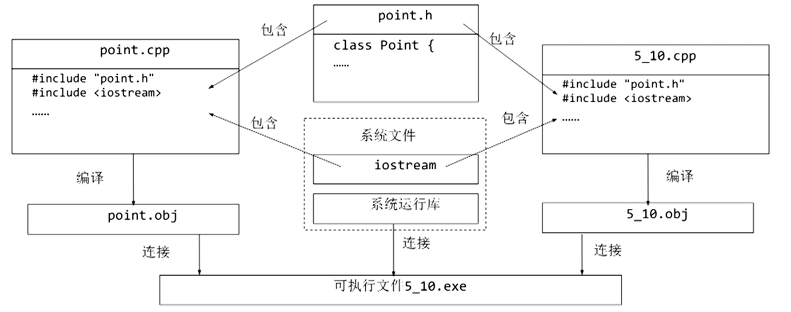

# 数据的共享与保护

[TOC]

+ 不同位置（函数体内、类体内、函数原型参数表内、所有函数和类之外）定义的变量和对象，其作用域、可见性、生存期都不同。 

+ 如何在同一个类的所有对象之间共享数据？比如需要记录一个类的对象总数。 
  + 定义属于整个类而不是对象的数据成员——静态数据成员
  + 定义用于处理静态数据成员的函数——静态成员函数

- 类的私有成员在类外不能直接访问，这是为了保护数据的安全性和隐藏细节。但是需要通过接口函数频繁访问私有数据时，调用接口函数的开销比较大。
  - 友元：对一些类外的函数、其他的类，给予授权，使之可以访问类的私有成员
  - 提高了效率，但是带来一些安全隐患，需要权衡、慎用

- 共享数据的安全性如何保证

  + 通过const关键字，限制对共享数据的修改，使共享的数据在被共享时，是只读的。

+ 编译预处理：在编译之前，需要进行预处理，例如包含头文件，选择在不同情况下编译程序的不同部分

+ 多文件结构：当程序的规模略大些的时候，就不能将所有代码放在一个文件里了 


## 标识符的作用域与可见性

作用域是一个标识符在程序正文中有效的区域。

作用域分类：

+ 函数原型作用域
+ 局部作用域（块作用域）
+ 类作用域
+ 文件作用域
+ 命名空间作用域 

### 函数原形作用域

+ 函数原型中的参数，其作用域始于函数形参表的 `(`，结束于函数形参表的 `)`。

+ 函数原形作用域举例：

  ```c++
  double area(double radius);
  ```

  radius 的作用域仅在于此，不能用于程序正文其它地方

### 局部作用域

+ 函数的形参、在块中声明的标识符；

+ 其作用域自声明处起，限于块中。

+ 局部作用域举例

  

  
### 类作用域

+ 类的成员具有类作用域，其范围包括类体本身和非内联成员函数的函数体。
+ 在类作用域以外访问类的成员：
  + 静态成员：通过类名，或者该类的对象名、对象引用访问。
  + 非静态成员：通过类名，或者该类的对象名、对象引用、对象指针访问。

### 文件作用域 

不在前述各个作用域中出现的声明，就具有文件作用域，这样声明的标识符其作用域开始于声明点，结束于文件尾。 

### 可见性

+ 可见性是从对标识符的引用的角度来谈的概念
+ 可见性表示从内层作用域向外层作用域“看”时能看见什么。
+ 如果标识在某处可见，就可以在该处引用此标识符。
+ 如果某个标识符在外层中声明，且在内层中没有同一标识符的声明，则该标识符在内层可见。
+ 对于两个嵌套的作用域，如果在内层作用域内声明了与外层作用域中同名的标识符， 则外层作用域的标识符在内层不可见。 

#### 例子

```c++
#include <iostream>
using namespace std;
int i; //全局变量，文件作用域
int main() {
    i = 5; //为全局变量 i 赋值
    {
        int i; //局部变量，局部作用域
        i = 7;
        cout << "i = " << i << endl;//输出 7
    }
    cout << “i = ” << i << endl;//输出 5
    return 0;
}
```


## 对象的生存期

+ 对象从产生到结束的这段时间就是它的生存期
+ 在对象生存期内，对象将保持它的值，直到被更新为止

### 静态生存期

- 这种生存期与程序的运行期相同。
- 在文件作用域中声明的对象具有这种生存期。
- 在函数内部声明静态生存期对象，要冠以关键字static 。

### 动态生存期

- 块作用域中声明的，没有用static修饰的对象是动态生存期的对象（习惯称局部生存期对象）。
- 开始于程序执行到声明点时，结束于命名该标识符的作用域结束处。

### 例子

```c++
#include<iostream>

using namespace std;

int i = 1; // i 为全局变量，具有静态生存期。

void other() {
    static int a = 2;
    static int b; // 静态局部变量没有初始化时，默认初始值为0
    // a,b为静态局部变量，具有全局寿命，局部可见。
    //只第一次进入函数时被初始化。
    int c = 10; // C为局部变量，具有动态生存期，每次进入函数时都初始化。
    a += 2; i += 32; c += 5;
    cout<<"---OTHER---\n";
    cout<<" i: "<<i<<" a: "<<a<<" b: "<<b<<" c: "<<c<<endl;
    b = a;
}

int main() {
    static int a;//静态局部变量，有全局寿命，局部可见。
    int b = -10; // b, c为局部变量，具有动态生存期。
    int c = 0;
    cout << "---MAIN---\n";
    cout<<" i: "<<i<<" a: "<<a<<" b: "<<b<<" c: "<<c<<endl;
    c += 8; other();
    cout<<"---MAIN---\n";
    cout<<" i: "<<i<<" a: "<<a<<" b: "<<b<<" c: "<<c<<endl;
    i += 10; other();  
    return 0;
}
```

运行结果：

```
---MAIN---
i: 1 a: 0 b: -10 c: 0
---OTHER---
i: 33 a: 4 b: 0 c: 15
---MAIN---
i: 33 a: 0 b: -10 c: 8
---OTHER---
i: 75 a: 6 b: 4 c: 15
```


## 类的静态成员

### 静态数据成员

+ 用关键字static声明
+ 为该类的所有对象共享，静态数据成员具有静态生存期。
+ 必须在类外定义和初始化，用 `::` 来指明所属的类。

### 静态函数成员

+ 类外代码可以使用类名和作用域操作符 `::` 来调用静态成员函数。

+ 静态成员函数主要用于处理该类的静态数据。

+ 静态成员函数如果访问非静态成员，要通过对象来访问。

### 例子：具有静态数据成员和静态函数成员的 Point 类


```c++
#include <iostream>
using namespace std;
class Point {    				//Point类定义
    public:      				//外部接口
       Point(int x = 0, int y = 0) : x(x), y(y) {  //构造函数
           //在构造函数中对count累加，所有对象共同维护同一个count
           count++; 
       }
       Point(Point &p) {    //复制构造函数
           x = p.x;
           y = p.y;
           count++;
       }
       ~Point() {  count--; }
       int getX() { return x; }
       int getY() { return y; }
       static void showCount() {   //输出静态数据成员
           cout << "  Object count = " << count << endl;
       }
    private:     				  //私有数据成员
       int x, y;
       static int count;          //静态数据成员声明，用于记录点的个数
};

int Point::count = 0;//静态数据成员定义和初始化，使用类名限定

int main() {      	   //主函数
    Point a(4, 5);     //定义对象a，其构造函数回使count增1
    cout << "Point A: " << a.getX() << ", " << a.getY();
    Point::showCount();       //输出对象个数
    Point b(a); //定义对象b，其构造函数回使count增1
    cout << "Point B: " << b.getX() << ", " << b.getY();
    Point::showCount();       //输出对象个数
    return 0;
}
```


## 类的友元

友元是C++提供的一种破坏数据封装和数据隐藏（以实现一定程度的对效率的追求）的机制。

通过将一个模块声明为另一个模块的友元，一个模块能够引用另一个模块中本是被隐藏的信息。

可以使用友元函数和友元类。

为了确保数据的完整性，及数据封装与隐藏的原则，建议尽量不使用或少使用友元。

### 友元函数

友元函数是在类声明中由关键字friend修饰说明的非本类成员函数，在它的函数体中能够通过对象名访问 private 和 protected成员

作用：增加灵活性，使程序员可以在封装和效率方面做合理选择。

访问对象中的成员必须通过对象名。

#### 例子：使用友元函数计算两点间距离

```c++
#include <iostream>
#include <cmath>

using namespace std;

class Point { 			//Point类声明
  public: 			    //外部接口
    Point(int x=0, int y=0) : x(x), y(y) { }
    int getX() { return x; }
    int getY() { return y; }
    friend float dist(Point &a, Point &b);
  private: 				//私有数据成员
    int x, y;
};

float dist( Point& a, Point& b) {
    double x = a.x - b.x;
    double y = a.y - b.y;
    return static_cast<float>(sqrt(x * x + y * y));
}

int main() {
    Point p1(1, 1), p2(4, 5);
    cout <<"The distance is: ";
    cout << dist(p1, p2) << endl;
    return 0;
}
```

### 友元类

若一个类为另一个类的友元，则此类的所有成员都能访问对方类的私有成员。

声明语法：将友元类名在另一个类中使用friend修饰说明。

```c++
class A {
    friend class B;
  public:
    void display() {
        cout << x << endl;
    }
  private:
    int x;
};

class B {
  public:
    void set(int i);
    void display();
  private:
    A a;
};

void B::set(int i) {
    a.x=i;
}

void B::display() {
    a.display();
};
```

class B 的成员是 class A 的对象，这是一个类的组合的问题 —— B 是组合类，A 是部件类，即 A 是 B 的组件。通过将 class B 声明为 class A 的友元类， class B 可以直接访问 class A 的私有数据成员 `int x`。

#### 类的友元关系是单向的

如果声明B类是A类的友元，B类的成员函数就可以访问A类的私有和保护数据，但A类的成员函数却不能访问B类的私有、保护数据。


## 共享数据的保护

+ 对于既需要共享、又需要防止改变的数据应该声明为**常类型**（用const进行修饰）。

+ 对于不改变对象状态的成员函数应该声明为**常函数**。

### 常类型

+ 常对象：必须进行初始化，不能被更新。

  ```c++
  const className objectName
  ```

+ 常成员：

  用const进行修饰的类成员：常数据成员和常函数成员

+ 常引用：被引用的对象不能被更新。

  ```c++
  const 类型说明符 &引用名
  ```

+ 常数组：数组元素不能被更新。

  ```c++
  类型说明符 const 数组名[大小]...
  ```

+ 常指针：指向常量的指针。

### 常对象

用const修饰的对象 

例：

```c++
class A
{
  public:
    A(int i,int j) {x=i; y=j;}
    ...
  private:
    int x,y;
};

A const a(3,4); //a是常对象，不能被更新
```

### 常成员

用const修饰的对象成员

#### 常成员函数

+ 使用const关键字说明的函数。

+ 常成员函数不更新对象的数据成员。

+ 常成员函数说明格式

  ```c++
  类型说明符 函数名(参数表)const;
  ```

  这里，const是函数类型的一个组成部分，因此在实现部分也要带const关键字。

+ const关键字可以被用于参与对重载函数的区分

+ 通过常对象只能调用它的常成员函数。

#### 常数据成员

使用const说明的数据成员。

#### 例子：常成员函数

```c++
#include<iostream>
using namespace std;
class R {
  public:
    R(int r1, int r2) : r1(r1), r2(r2) { }
    void print();
    void print() const;
  private:
    int r1, r2;
};

void R::print() {
    cout << r1 << ":" << r2 << endl;
}

void R::print() const {
    cout << r1 << ";" << r2 << endl;
}

int main() {
    R a(5,4);
    a.print(); //调用void print()
    const R b(20,52); 
    b.print(); //调用void print() const
    return 0;
}
```

#### 例子：常数据成员

```c++
#include <iostream>

using namespace std;

class A {
  public:
    A(int i);
    void print();
  private:
    const int a;
    static const int b;  //静态常数据成员
};

const int A::b=10;
A::A(int i) : a(i) { }   // 常数据成员只能在初始化列表中进行初始化
						 // 不能放在构造函数函数体中进行初始化

void A::print() {
    cout << a << ":" << b <<endl;
}

int main() {
    //建立对象a和b，并以100和0作为初值，分别调用构造函数，
    //通过构造函数的初始化列表给对象的常数据成员赋初值
    A a1(100), a2(0);
    a1.print();
    a2.print();
    return 0;
}
```

### 常引用

如果在声明引用时用**const**修饰，被声明的引用就是常引用。

常引用所引用的对象不能被更新。

如果用常引用做形参，便不会意外地发生对实参的更改。常引用的声明形式如下：

```c++
const 类型说明符 &引用名;
```

在友元函数中用常引用做参数，既能获得较高的执行效率，又能保证实参的安全性（保证不会被修改）。

#### 例子：常引用作形参

```c++
#include <iostream>
#include <cmath>

using namespace std;

class Point { //Point类定义
  public:          //外部接口
    Point(int x = 0, int y = 0): x(x), y(y) { }
    int getX() { return x; }
    int getY() { return y; }
    friend float dist(const Point &p1,const Point &p2);
  private:         //私有数据成员
    int x, y;
};

float dist(const Point &p1, const Point &p2) {
    double x = p1.x - p2.x; 
    double y = p1.y - p2.y;
    return static_cast<float>(sqrt(x*x+y*y));
}

int main() {  //主函数
    const Point myp1(1, 1), myp2(4, 5);    
    cout << "The distance is: ";
    cout << dist(myp1, myp2) << endl;
    return 0;
}
```


## 多文件结构和编译预处理命令

### C++程序的一般组织结构

一个工程可以划分为多个源文件：

+ 类声明文件（.h文件）
+ 类实现文件（.cpp文件）
+ 类的使用文件（main()所在的.cpp文件）

利用工程来组合各个文件。

#### 例子：多文件工程

```c++
//文件1，类的定义，Point.h
class Point { //类的定义
  public:          //外部接口
    Point(int x = 0, int y = 0) : x(x), y(y) { }
    Point(const Point &p);
    ~Point() { count--; }
    int getX() const { return x; }
    int getY() const { return y; }
    static void showCount();          //静态函数成员
  private:         //私有数据成员
    int x, y;
    static int count; //静态数据成员
};

 
//文件2，类的实现，Point.cpp
#include "Point.h"
#include <iostream>

using namespace std;

int Point::count = 0;            //使用类名初始化静态数据成员
Point::Point(const Point &p) : x(p.x), y(p.y) {
    count++;
}
void Point::showCount() {
    cout << "  Object count = " << count << endl;
}

 
//文件3，主函数，5_10.cpp
#include "Point.h"
#include <iostream>

using namespace std;

int main() {
    Point a(4, 5);      //定义对象a，其构造函数使count增1
    cout <<"Point A: "<<a.getX()<<", "<<a.getY();
    Point::showCount();      //输出对象个数
    Point b(a);         //定义对象b，其构造函数回使count增1
    cout <<"Point B: "<<b.getX()<<", "<<b.getY();
    Point::showCount();      //输出对象个数
    return 0;
}
```



### 外部变量

如果一个变量除了在定义它的源文件中可以使用外，还能被其它文件使用，那么就称这个变量是外部变量。

文件作用域中定义的变量，默认情况下都是外部变量，但在其它文件中如果需要使用这一变量，需要用extern关键字加以声明。

### 外部函数

在所有类之外声明的函数（也就是非成员函数），都是具有文件作用域的。

这样的函数都可以在不同的编译单元中被调用，只要在调用之前进行引用性声明（即声明函数原型）即可。也可以在声明函数原型或定义函数时用extern修饰，其效果与不加修饰的默认状态是一样的。

### 将变量和函数限制在编译单元内

使用匿名的命名空间：在匿名命名空间中定义的变量和函数，都不会暴露给其它的编译单元。

```c++
namespace {         //匿名的命名空间
    int n;
    void f() {
        n++;
    }
}
```

这里被 `namespace {...}` 括起的区域都属于匿名的命名空间。 

### 标准C++库

标准C++类库是一个极为灵活并可扩展的可重用软件模块的集合。标准C++类与组件在逻辑上分为6种类型：

+ 输入/输出类
+ 容器类与抽象数据类型
+ 存储管理类
+ 算法
+ 错误处理
+ 运行环境支持

### 编译预处理

#### #include 包含指令

将一个源文件嵌入到当前源文件中该点处。

```c++
#include<fileName> 
```

按标准方式搜索，文件位于C++系统目录的include子目录下

```c++
#include"fileName"
```

首先在当前目录中搜索，若没有，再按标准方式搜索。

#### #define 宏定义指令

定义符号常量，很多情况下已被const定义语句取代。

定义带参数宏，已被内联函数取代。

#### #undef

删除由#define定义的宏，使之不再起作用。

### 条件编译指令

#### #if 和 #endif

```c++
#if 常量表达式
	//当“ 常量表达式”非零时编译
    程序正文 
#endif
```

#### #else

```c++
#if 常量表达式
	// 当“常量表达式”非零时编译
	程序正文1  
#else
    // 当“常量表达式”为零时编译
    程序正文2     
#endif
```

#### #elif

```c++
#if 常量表达式1
	// 当“常量表达式1”非零时编译
	程序正文1 
#elif 常量表达式2
    // 当“常量表达式2”非零时编译
  	程序正文2 
#else
    // 其他情况下编译
    程序正文3 
#endif
```

#### #ifdef 与 #ifndef

```c++
#ifdef 标识符
	程序段1
#else
	程序段2
#endif
```

如果“标识符”经 #defined 定义过，且未经 #undef 删除，则编译程序段1；否则编译程序段2。

```c++
#ifndef 标识符
	程序段1
#else
	程序段2
#endif
```

如果“标识符”未被定义过，则编译程序段1；否则编译程序段2。